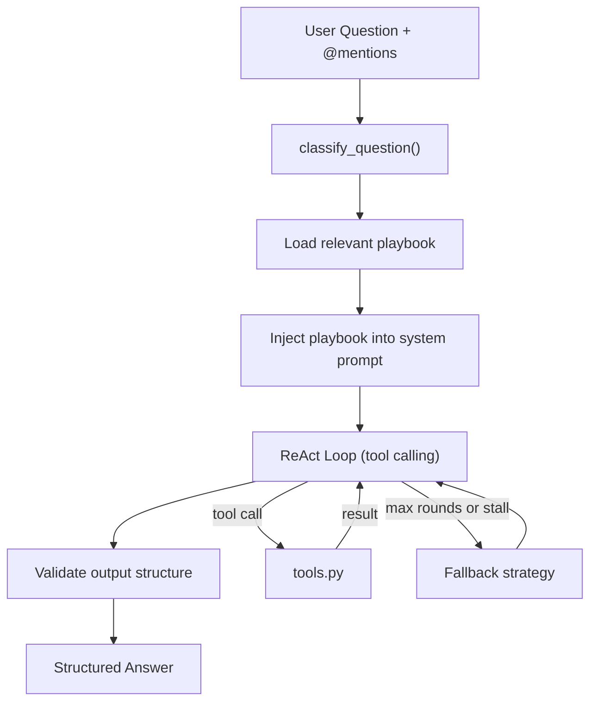

# Agent Workflows Plan Update

Update the existing plan at [`.cursor/plans/codebase_navigation_agent_eba52ff7.plan.md`](.cursor/plans/codebase_navigation_agent_eba52ff7.plan.md) by replacing the M12 section (lines 1188-1198) with a comprehensive agent workflows section and adding a new top-level "Supported Agent Workflows" section after M11.

---

## New Section: Supported Agent Workflows (insert after M11, before M12)

### Workflow Taxonomy (6 Tiers)

#### Tier 1: Direct Lookup (1-2 tool calls)

- **W1: Symbol Definition Lookup** -- "Where is `User` defined?"
  - `search_symbols("User", kind="class")` -> return file + line + signature
- **W2: File Reading** -- "Show me services.py"
  - `read_snippet("services.py")` -> return content
- **W3: File/Directory Listing** -- "What files are in the project?"
  - `list_tree(".")` -> return tree
- **W4: Text Search** -- "Where is 'TODO' mentioned?"
  - `search_text("TODO")` -> return matches with context

#### Tier 2: Navigational (2-4 tool calls, follow a trail)

- **W5: Go-to-Definition (with position hint)** -- "What is `User` at line 2, char 21 in services.py?"
  - `get_definition(file, line, char)` -> `read_snippet(target, lines)` -> return definition
- **W6: Go-to-Definition (without position hint)** -- "What is `format_date` used in services.py?"
  - `read_snippet("services.py")` -> find symbol position -> `get_definition(file, line, char)` -> `read_snippet(target)` -> return definition
- **W7: Go-to-Definition (no file hint)** -- "Find where `truncate` is defined"
  - `search_symbols("truncate")` or `search_text("def truncate")` -> resolve best match -> `read_snippet(target)` -> return definition
- **W8: Import Tracing** -- "What does services.py import?"
  - `get_imports("services.py")` -> for each import, resolve to file -> return dependency list
- **W9: Reverse Import Tracing** -- "Who imports models.py?"
  - `trace_module("models.py", direction="reverse")` -> return dependent files

#### Tier 3: Analytical (4-8 tool calls, requires reasoning)

- **W10: Feature Explanation** -- "How does authentication work?"
  - `search_summaries("auth")` -> `search_symbols("auth")` -> inspect top files -> follow imports -> find route/service/model/test files -> synthesize explanation with file paths
- **W11: Impact Analysis** -- "What breaks if I change `create_user`?"
  - `get_definition("create_user")` -> `find_references("create_user")` -> `trace_module(file)` -> `find_tests(file)` -> return impacted files + risk assessment
- **W12: Test Discovery** -- "What tests cover services.py?"
  - `find_tests("services.py")` -> or `search_text("services", glob="test_*")` -> query test_map -> return test files + pytest command
- **W13: Call Graph Exploration** -- "What does `process_order` call?"
  - `get_definition("process_order")` -> `get_call_graph("process_order", direction="downstream")` -> resolve each callee -> return call tree
- **W14: Reverse Call Graph** -- "What calls `validate_email`?"
  - `find_references("validate_email")` -> filter to call sites -> return callers with context

#### Tier 4: Structural Understanding (multi-step, cross-cutting)

- **W15: Module/Package Overview** -- "Explain the `services/` directory"
  - `get_directory_summary("services/")` -> `list_tree("services/")` -> read key symbols from each file -> explain responsibilities + interactions
- **W16: Architecture Map** -- "What's the high-level architecture?"
  - `repo_map(depth=2)` -> identify layers from roles -> trace inter-module imports -> return layered explanation
- **W17: Interface/API Surface** -- "What's the public API of this module?"
  - `search_symbols(file, kind="function|class")` -> filter exported (no underscore prefix) -> get signatures + docstrings -> return API surface
- **W18: Dependency Graph** -- "Show me the dependency graph"
  - `trace_module(file, direction="both")` for key files -> identify cycles -> identify leaf vs hub modules -> return graph description

#### Tier 5: Change-Oriented (reasoning about modifications)

- **W19: Safe Refactoring Scope** -- "Can I safely rename `get_user` to `fetch_user`?"
  - `find_references("get_user")` -> check all usage sites -> `find_tests` -> check dynamic references (`search_text('"get_user"')`) -> return scope + risk
- **W20: Dead Code Detection** -- "Is `legacy_handler` still used?"
  - `find_references("legacy_handler")` -> check import graph -> assess reachability -> return verdict
- **W21: Missing Test Coverage** -- "What functions lack test coverage?"
  - `search_symbols(kind="function")` for source -> cross-reference with `find_tests` -> identify untested -> return list
- **W22: Breaking Change Assessment** -- "What if I remove the `email` field from `User`?"
  - `get_definition("User")` -> `find_references("email")` scoped to User usages -> trace through all usages -> identify validators/serializers/tests -> return impact

#### Tier 6: Contextual/Conversational (stateful)

- **W23: Follow-up Drill-down** -- "Tell me more about that second file"
  - Retrieve prior context -> resolve reference -> `read_snippet` -> explain
- **W24: Comparison** -- "How does `create_user` differ from `create_admin`?"
  - `get_definition` for both -> compare signatures, bodies, dependencies -> highlight differences
- **W25: Code Reading with Explicit Context** -- "Explain @services.py"
  - Parse @mention -> `get_file_summary("services.py")` -> read key symbols -> explain responsibilities

---

### Workflow Classification Logic

The classifier routes questions to workflows using a two-stage approach:

**Stage 1: Keyword/Pattern Matching (fast, deterministic)**

```python
WORKFLOW_PATTERNS = {
    "symbol_lookup": [
        r"where is (\w+) defined",
        r"find (\w+)",
        r"what is (\w+)",
        r"show me the definition of",
    ],
    "goto_definition_with_hint": [
        r"at line (\d+).*char(acter)? (\d+)",
        r"position (\d+)[,:](\d+)",
    ],
    "feature_explanation": [
        r"how does .+ work",
        r"explain .+",
        r"what does .+ do",
    ],
    "impact_analysis": [
        r"what breaks if",
        r"what depends on",
        r"is it safe to (change|rename|remove|delete)",
        r"impact of (changing|removing|modifying)",
    ],
    "test_discovery": [
        r"what tests cover",
        r"how is .+ tested",
        r"find tests for",
    ],
    "architecture": [
        r"(high.level|overall) (architecture|structure)",
        r"how is .+ organized",
    ],
}
```

**Stage 2: LLM Classification (for ambiguous cases)**

If no pattern matches with high confidence, use a cheap LLM call:

```python
CLASSIFY_PROMPT = """Classify this codebase question into exactly one workflow type:
- symbol_lookup: finding where something is defined
- goto_definition: navigating to a symbol's source (may have position hints)
- feature_explanation: understanding how a feature works end-to-end
- impact_analysis: understanding what would break if something changes
- test_discovery: finding tests that cover some code
- architecture: understanding overall structure/organization
- import_tracing: understanding dependencies between files
- call_graph: understanding what calls what
- refactoring: assessing safety of code changes
- dead_code: checking if something is still used
- comparison: comparing two symbols or implementations

Question: {question}
@-mentioned files: {mentioned_files}

Return JSON: {"workflow": "...", "extracted_params": {...}}
"""
```

**Extracted Parameters**: The classifier also extracts structured parameters from the question:

- Symbol name(s)
- File path(s)
- Position hints (line, char)
- Direction (forward/reverse)
- Scope constraints

---

### Workflow Execution: Playbook-Driven Agent

Each workflow has a **playbook** -- a structured set of instructions injected into the agent's system prompt that guides its tool usage. The key insight: rather than hard-coding the exact tool sequence, we give the agent a **strategy** and let it adapt.

**Architecture:**



**Playbook Structure (per workflow):**

```python
@dataclass
class WorkflowPlaybook:
    workflow_type: str
    trigger_description: str
    required_tools: list[str]
    strategy_steps: list[str]       # ordered guidance
    output_format: str              # what a good answer looks like
    failure_chains: list[str]       # what to do when steps fail
    early_termination: str          # when to stop early
    max_tool_rounds: int            # budget for this workflow
```

**Example Playbook -- Feature Explanation:**

```
STRATEGY: Feature Explanation
Trigger: "how does X work", "explain X"
Budget: 8 tool rounds max

Steps:
1. search_summaries(query) -- find files whose summaries mention the feature
2. For the top 2-3 files: get_file_summary(path) -- understand purpose
3. search_symbols(feature_name) -- find concrete symbols
4. get_definition for key symbols -- read implementations
5. get_imports for those files -- understand dependencies
6. find_tests -- see how it's exercised
7. Synthesize: explain the feature flow file-by-file with line references

Output format:
- One-paragraph overview
- File-by-file breakdown with paths and key functions
- Data flow description
- Related test files

If search_summaries returns nothing:
- Fallback to search_text(feature_keywords)
- Then read_snippet on top matches

Early termination:
- If only 1 file matches and it's small, just explain that file directly
```

**Example Playbook -- Impact Analysis:**

```
STRATEGY: Impact Analysis
Trigger: "what breaks if I change X", "what depends on X"
Budget: 6 tool rounds max

Steps:
1. get_definition(symbol) -- locate the target
2. find_references(symbol) -- all usage sites
3. trace_module(file, direction="reverse") -- import dependents
4. find_tests(symbol) -- test coverage
5. Assess risk based on reference count + test coverage

Output format:
- Definition location
- List of affected files with specific line references
- Test coverage status
- Risk level (High/Medium/Low) with justification

If find_references returns 0:
- Check name_reference_map via search_text
- Symbol might be used dynamically (search for string references)

Early termination:
- If symbol is only used in its own file + tests, report "Low risk, locally scoped"
```

---

### Failure/Fallback Chains

Every workflow has defined fallback behavior when tools return empty:

| Tool That Failed                      | Fallback Strategy                                    |
| ------------------------------------- | ---------------------------------------------------- | ---------------- |
| `search_symbols` returns 0            | Try `search_text("(def                               | class)\s+NAME")` |
| `get_definition` (LSP) fails          | Fall back to tree-sitter symbol lookup in index      |
| `find_references` returns 0           | Check `name_reference_map`, then `search_text(NAME)` |
| `search_summaries` returns 0          | Fall back to `search_text` with feature keywords     |
| `get_file_summary` not cached         | Generate on-the-fly from index facts                 |
| `trace_module` finds no deps          | File is a leaf module; report as isolated            |
| `get_call_graph` can't resolve a call | Mark as "unresolved" but continue with others        |
| `find_tests` returns 0                | Report "no tests found" as part of risk assessment   |

**Global fallback**: If the classified workflow stalls (3 consecutive tool calls return nothing useful), the agent should:

1. Re-read the question
2. Try a broader search term
3. If still nothing, report what it tried and what it found (partial answer > no answer)

---

### M12 Replacement: Agent Loop Implementation

The updated `agent_loop.py` becomes a concrete workflow engine:

```python
class AgentLoop:
    def __init__(self, index, graph, lsp, tools, dev_logger, user_logger):
        self.index = index
        self.graph = graph
        self.lsp = lsp
        self.tools = tools
        self.dev_logger = dev_logger
        self.user_logger = user_logger
        self.playbooks = load_all_playbooks()

    def answer(self, raw_query: str) -> StructuredAnswer:
        # 1. Parse @mentions
        parsed = parse_query(raw_query, self.index)

        # 2. Classify
        workflow_type, params = classify_question(
            parsed.clean_query, parsed.mentioned_files
        )
        playbook = self.playbooks[workflow_type]

        # 3. Inject playbook into system prompt
        system_prompt = build_system_prompt(playbook, parsed.mentioned_files)

        # 4. Execute ReAct loop with tool budget
        result = self.react_loop(
            system_prompt=system_prompt,
            question=parsed.clean_query,
            context_files=parsed.mentioned_files,
            max_rounds=playbook.max_tool_rounds,
        )

        # 5. Validate output matches expected format
        answer = self.validate_and_format(result, playbook.output_format)
        return answer

    def react_loop(self, system_prompt, question, context_files, max_rounds):
        """OpenAI-style ReAct loop with playbook guidance."""
        messages = [
            {"role": "system", "content": system_prompt},
            {"role": "user", "content": self._build_user_message(question, context_files)},
        ]

        for round in range(max_rounds):
            response = self.llm_call(messages)

            if response.is_final_answer:
                return response.content

            for tool_call in response.tool_calls:
                result = self.execute_tool(tool_call)
                messages.append(tool_result_message(tool_call, result))

                # Check for early termination
                if self.should_terminate_early(tool_call, result, playbook):
                    return self.synthesize_early(messages)

        # Budget exhausted -- synthesize from what we have
        return self.synthesize_from_partial(messages)
```

**Key additions to M12:**

- Workflow classification (pattern + LLM hybrid)
- Playbook loading and system prompt injection
- Early termination logic
- Failure detection and fallback triggering
- Budget enforcement per workflow type
- Partial answer synthesis when budget runs out

---

### Testing Workflows (addition to M15)

New test file: `test_workflows.py`

- Test classification accuracy: 50+ example questions mapped to expected workflow types
- Test each playbook produces expected tool call sequences on `sample_repo`
- Test fallback chains trigger correctly when tools return empty
- Test early termination fires when conditions met
- Test budget enforcement (agent stops after max_rounds)
- End-to-end: question -> structured answer for each workflow tier
