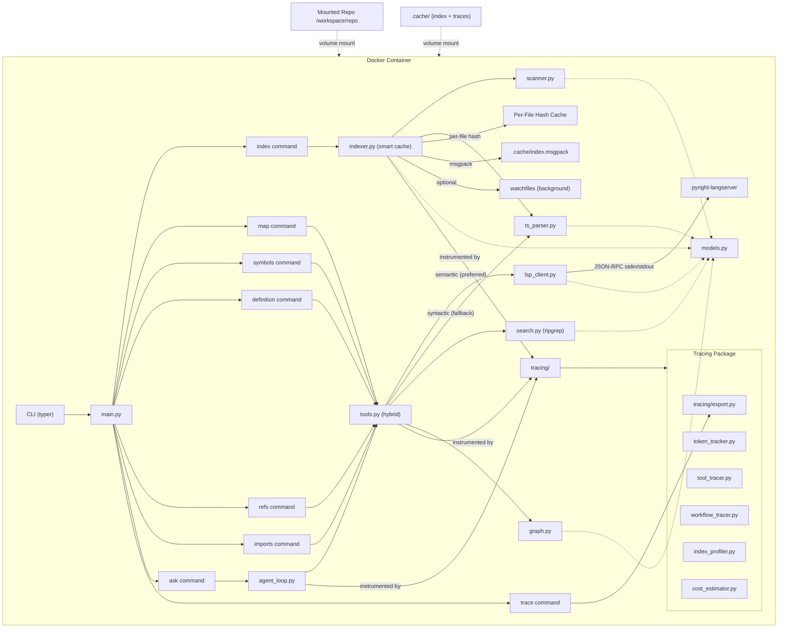
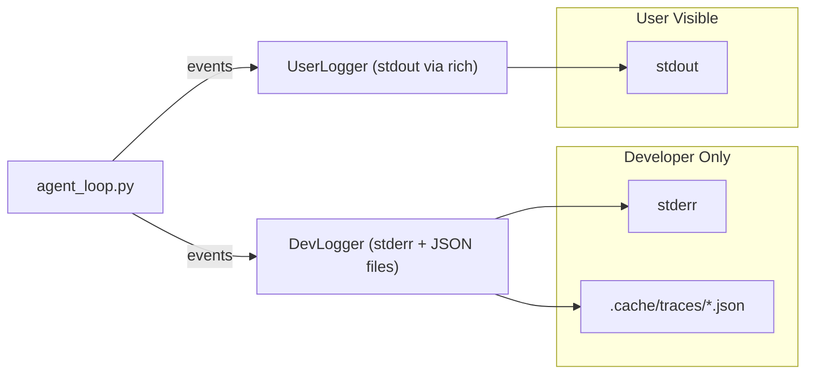

# Codebase Navigation Agent -- Implementation Plan

## Relationship to Existing Code

The existing [`interview-lsp/`](interview-lsp/) project has a working OpenAI agent loop, 3 basic tools, and Docker config. The new `codebase-agent/` project will be built as a **sibling directory** with a more capable architecture. We will reference patterns from `interview-lsp/agent.py` (e.g., the ReAct loop, Tool dataclass) but will not modify the original project.

---

## Architecture Overview



---

## File Structure

```
codebase-agent/
├── Dockerfile
├── docker-compose.yml
├── README.md
├── pyproject.toml
├── requirements.txt
├── .env.example
├── .dockerignore
├── src/
│   └── codebase_agent/
│       ├── __init__.py
│       ├── main.py          # typer CLI
│       ├── config.py         # constants, default ignores
│       ├── models.py         # Pydantic: FileRecord, SymbolRecord, ImportRecord, etc.
│       ├── scanner.py        # repo walking, file metadata
│       ├── ts_parser.py      # tree-sitter based code parser (Python grammar first)
│       ├── indexer.py        # smart index: in-memory session, per-file hash, msgpack, watcher
│       ├── search.py         # ripgrep primary, Python re fallback, symbol search
│       ├── graph.py          # import graph, reverse deps (networkx)
│       ├── lsp_client.py     # Pyright LSP server lifecycle + JSON-RPC communication
│       ├── tools.py          # 15+ agent-facing tool functions (hybrid LSP/tree-sitter)
│       ├── summarizer.py     # three-tier NL summaries: file, symbol, directory
│       ├── cli_completer.py  # @-mention file autocomplete + query parser
│       ├── agent_loop.py     # RLM-inspired question workflow
│       ├── logging/
│       │   ├── __init__.py
│       │   ├── dev_logger.py      # developer-facing: full observability
│       │   ├── user_logger.py     # user-facing: real-time progress + summary
│       │   └── base.py            # shared LogEvent model, log levels, routing
│       └── tracing/
│           ├── __init__.py
│           ├── token_tracker.py   # per-call and cumulative token accounting
│           ├── tool_tracer.py     # tool call logging: args, result size, latency
│           ├── workflow_tracer.py # full question-to-answer trace spans
│           ├── index_profiler.py  # index build/load timing, cache hits
│           ├── cost_estimator.py  # token-to-USD mapping per model
│           └── export.py          # JSON/rich console trace export
├── tests/
│   ├── __init__.py
│   ├── test_scanner.py
│   ├── test_ts_parser.py
│   ├── test_indexer.py
│   ├── test_summarizer.py
│   ├── test_lsp_client.py
│   ├── test_tools.py
│   ├── test_cli_completer.py
│   ├── test_dev_logging.py
│   └── test_user_logging.py
└── examples/
    └── sample_repo/          # copied from interview-lsp/sample_project
        ├── __init__.py
        ├── models.py
        ├── services.py
        └── utils.py
```

---

## Module-by-Module Build Plan

### M1: Project scaffolding + Docker (Milestone 1)

- Create directory structure, `pyproject.toml`, `requirements.txt`
- `Dockerfile` based on `python:3.11-slim`:
  - Install build deps: `build-essential` (for tree-sitter C compilation)
  - Install `ripgrep` via `apt-get` for fast text search
  - Install `nodejs` + `npm` via `apt-get`, then `npm install -g pyright` for the LSP server (do NOT use the `pyright` PyPI wrapper -- install via npm directly for a cleaner, properly versioned binary)
  - Verify with `RUN pyright-langserver --version`
  - Sets `PYTHONPATH=/app/src`
- `docker-compose.yml` with volume mounts for repo and cache
- `main.py` with typer CLI skeleton (commands: `index`, `map`, `symbols`, `definition`, `refs`, `imports`, `ask`, `summarize`, `summary`, `trace`)
- `config.py` with `DEFAULT_IGNORE_DIRS` set
- Done when `docker compose run agent python -m codebase_agent.main --help` works

### M2: Data models ([`src/codebase_agent/models.py`](src/codebase_agent/models.py))

- Pydantic `BaseModel` classes:
  - `FileRecord`, `SymbolRecord`, `ImportRecord`, `ReferenceRecord` -- core data
  - `RepoIndex` -- now includes `test_map: dict[str, list[str]]` and `name_reference_map: dict[str, list[str]]`
  - `RepoMapNode` -- recursive model for hierarchical repo map
  - `ParseResult` -- return type from ts_parser (symbols, imports, identifier_refs)
  - `CallGraphNode` -- recursive model for on-demand call graph
  - `SymbolCandidate`, `DisambiguatedResult` -- for multi-candidate disambiguation
  - `FileSummary` -- structured NL summary for a file (purpose, responsibilities, side_effects, confidence, provenance)
  - `SymbolSummary` -- short NL description for important classes/functions (summary, side_effects, raises)
  - `DirectorySummary` -- folder-level summary (summary, contains, common_dependencies)
  - `CachedSummary` -- wraps file_hash + FileSummary + list[SymbolSummary] for cache invalidation
- Exact fields as specified in the brief (Section 5) plus the new relationship and summary fields

### M3: Repository scanner ([`src/codebase_agent/scanner.py`](src/codebase_agent/scanner.py))

- `scan_repo(root_path, ignore_dirs)` -> `list[FileRecord]`
- Walks directory tree, skips `DEFAULT_IGNORE_DIRS`, collects file metadata (path, language, size, line count)
- Wire to `map` CLI command

### M4: Tree-sitter parser ([`src/codebase_agent/ts_parser.py`](src/codebase_agent/ts_parser.py))

Uses `tree-sitter` + `tree-sitter-python` to parse Python files into concrete syntax trees (CST).

Key advantages over stdlib `ast`:

- **Error-tolerant**: files with syntax errors still produce partial trees (error nodes are marked)
- **Multi-language ready**: adding `tree-sitter-javascript`, `tree-sitter-typescript`, etc. later is a grammar swap
- **Incremental parsing**: can re-parse only changed byte ranges (enables fast re-indexing)
- **Byte-level precision**: exact start/end byte offsets for every node

Implementation:

- `parse_file(file_path: str, language: str = "python")` -> `tuple[list[SymbolRecord], list[ImportRecord]]`
- Initialize `tree_sitter.Parser()` once, load `tree_sitter_python.language()` grammar
- Use **tree-sitter queries** (S-expression patterns) to extract nodes:

```scheme
;; Functions
(function_definition name: (identifier) @func_name) @func_def

;; Async functions
(function_definition name: (identifier) @async_func_name) @async_func_def

;; Classes
(class_definition name: (identifier) @class_name) @class_def

;; Methods (functions inside classes)
(class_definition body: (block (function_definition name: (identifier) @method_name) @method_def))

;; Imports
(import_statement name: (dotted_name) @import_name)
(import_from_statement module_name: (dotted_name) @from_module)
```

- Extract **signatures** by reading the source bytes from the function node start to the colon (`:`) -- this gives the exact source text of the signature including annotations, no unparse needed
- Extract **docstrings** by checking if the first child of the function body is an `expression_statement > string` node
- Extract **line ranges** from `node.start_point` and `node.end_point` (row, column tuples)
- Handle parse errors: if `tree.root_node.has_error`, log warning via DevLogger but still extract whatever nodes parsed successfully
- Wire to `symbols` CLI command

#### 4b. Identifier Reference Collection (for coarse name_reference_map)

During the same tree-sitter parse pass, also collect all `identifier` nodes for the name reference map. This adds near-zero cost since the tree is already built.

> **Important**: This is a **coarse, name-based** reference map -- not semantic. Every `User` identifier is collected regardless of which `User` it actually refers to. This is intentional: the `name_reference_map` is used for **fast candidate discovery** (O(1) lookup of "which files mention this name?"). Exact reference resolution is delegated to LSP (`textDocument/references`) when available, or to the import-aware symbol resolver for disambiguation.

Extended return type:

```python
def parse_file(file_path: str, language: str = "python") -> ParseResult:
    """Returns symbols, imports, AND identifier references."""

class ParseResult(BaseModel):
    symbols: list[SymbolRecord]
    imports: list[ImportRecord]
    identifier_refs: list[str]  # names of identifiers found (deduplicated per file)
```

Query all identifiers:

```scheme
(identifier) @ident
```

Filter logic:

- Check each identifier name against the known symbol set (built after first pass over all files)
- Skip definition sites: parent is `class_definition.name`, `function_definition.name`, or `import_from_statement`
- Skip Python builtins and keywords
- Store as deduplicated set of names per file (file-level granularity, not line-level -- keeps the index compact)

This requires a **two-phase indexing** approach:

1. **Phase 1**: parse all files -> collect symbols and imports -> build known symbol name set
2. **Phase 2**: re-traverse each file's tree (still cached in memory) -> collect identifier references matching known symbols

Phase 2 is fast since tree-sitter trees are already in memory from phase 1.

### M5: Smart Indexer ([`src/codebase_agent/indexer.py`](src/codebase_agent/indexer.py))

The indexer orchestrates scanner + ts_parser but now with four levels of caching to avoid redundant work.

#### 5a. In-Memory Session Index

The `RepoIndex` object is held in memory for the duration of a CLI session. If the user asks 5 questions via `ask`, the index is loaded from disk once and reused for all subsequent queries. Implemented via a module-level singleton:

```python
_session_index: RepoIndex | None = None

def get_or_build_index(root_path: str) -> RepoIndex:
    global _session_index
    if _session_index is not None and _session_index.root_path == root_path:
        return _session_index
    _session_index = build_index(root_path)
    return _session_index
```

#### 5b. Per-File Content Hash for Incremental Re-Index

Instead of all-or-nothing invalidation, each file's parse result is cached by its content hash (`hashlib.sha256`). When rebuilding:

```python
for file in scanned_files:
    current_hash = hashlib.sha256(file_content).hexdigest()
    if current_hash == cached_hashes.get(file.path):
        symbols, imports = cached_results[file.path]  # skip re-parse
    else:
        symbols, imports = parse_file(file.path)       # re-parse only this file
        cached_results[file.path] = (symbols, imports)
        cached_hashes[file.path] = current_hash
```

This means changing 1 file in a 500-file repo re-parses only that 1 file. The hash map is stored alongside the index.

#### 5c. msgpack Serialization

Replace JSON with `msgpack` for the on-disk index format. msgpack is a binary format that is:

- 2-5x faster to serialize/deserialize than JSON
- 30-50% smaller on disk
- Pydantic v2 supports custom serialization via `model_dump()` -> dict -> `msgpack.packb()`

```python
import msgpack

def save_index(index: RepoIndex, output_path: str) -> None:
    data = index.model_dump()
    packed = msgpack.packb(data, use_bin_type=True)
    Path(output_path).write_bytes(packed)

def load_index(index_path: str) -> RepoIndex:
    packed = Path(index_path).read_bytes()
    data = msgpack.unpackb(packed, raw=False)
    return RepoIndex.model_validate(data)
```

Index file: `.cache/codebase_index.msgpack`
Hash cache: `.cache/file_hashes.msgpack`

#### 5d. Background File Watcher (optional, via `watchfiles`)

When running in server/interactive mode, a background thread watches the mounted repo for changes using `watchfiles` (a Python wrapper around the Rust `notify` crate). On file change:

- Detect which files changed
- Re-hash and re-parse only those files
- Update the in-memory index
- Persist updated index + hashes to disk

```python
from watchfiles import watch

def start_watcher(root_path: str, index: RepoIndex) -> None:
    for changes in watch(root_path):
        for change_type, path in changes:
            if path.endswith(".py"):
                update_index_for_file(index, path, change_type)
```

This runs in a daemon thread so the CLI remains responsive. Enabled via `--watch` flag. For single-shot CLI commands (e.g., `ask`), the watcher is not started.

#### 5e. Test Map (precomputed at index time)

During indexing, detect test files and record which source files they cover:

```python
def _is_test_file(path: str) -> bool:
    """Heuristic: file is under tests/ or named test_*.py or *_test.py."""
    parts = Path(path).parts
    name = Path(path).name
    return "tests" in parts or name.startswith("test_") or name.endswith("_test.py")
```

For each test file, examine its imports. If `tests/test_auth.py` imports from `app.auth`, record:

```python
test_map["app/auth.py"].append("tests/test_auth.py")
```

Stored in `RepoIndex.test_map: dict[str, list[str]]` -- source file -> test files that cover it.

#### 5f. Coarse Name Reference Map (precomputed at index time)

Built from the identifier references collected by ts_parser phase 2:

```python
name_reference_map: dict[str, list[str]]  # symbol_name -> list of file paths that mention it
```

> **This is a coarse precomputed map used for fast candidate discovery. Exact reference resolution is delegated to LSP when available.** The map is name-based, not semantic -- every `User` identifier in a file causes that file to appear under the `"User"` key, regardless of which `User` class it actually refers to. This is acceptable because:
>
> 1. It enables instant O(1) "which files mention this name?" queries without disk I/O
> 2. The disambiguation layer (Phase 2-4 of the symbol resolver) narrows the candidates semantically
> 3. LSP `textDocument/references` provides exact semantic references when available

For each file's `identifier_refs` list, add the file to the name reference map for each symbol:

```python
for file_path, parse_result in all_results.items():
    for symbol_name in parse_result.identifier_refs:
        name_reference_map[symbol_name].append(file_path)
```

#### Index fields summary

```python
class RepoIndex(BaseModel):
    root_path: str
    files: list[FileRecord]
    symbols: list[SymbolRecord]
    imports: list[ImportRecord]
    test_map: dict[str, list[str]]            # source file -> test files
    name_reference_map: dict[str, list[str]]  # symbol name -> files that mention it (coarse, name-based)
```

- Wire to `index` CLI command
- Done when re-indexing a 500-file repo after changing 1 file takes <100ms

### M6: Search module ([`src/codebase_agent/search.py`](src/codebase_agent/search.py))

- `search_text(root_path, query, file_glob)` -- primary: ripgrep via subprocess (`rg --json`), fallback: Python `re` if rg not installed. Ripgrep is 10-100x faster than pure Python regex on large repos (Rust, memory-mapped I/O, parallel directory walking, automatic `.gitignore` respect).
- `search_symbols(index, query)` -- ranked search over in-memory index: exact > prefix > path > substring > docstring
- `search_files(index, query)` -- file path keyword search

### M7: Multi-Edge Dependency Graph ([`src/codebase_agent/graph.py`](src/codebase_agent/graph.py))

Uses a single `networkx MultiDiGraph` with typed edges to represent all precomputed relationships:

```python
import networkx as nx

G = nx.MultiDiGraph()
G.add_edge("app/services.py", "app/models.py", type="import")
G.add_edge("tests/test_auth.py", "app/auth.py", type="test")
G.add_edge("app/api/users.py", "app/models.py", type="reference", symbol="User")
```

Functions:

- `build_dependency_graph(index: RepoIndex)` -> `nx.MultiDiGraph` -- builds from import list, test_map, and name_reference_map
- `get_dependencies(graph, file_path, edge_type=None)` -- forward deps, optionally filtered by edge type
- `get_dependents(graph, file_path, edge_type=None)` -- reverse deps
- `get_test_files(graph, file_path)` -- shortcut: reverse deps with type="test"
- `get_files_referencing(graph, symbol_name)` -- files that mention a symbol (from name_reference_map edges)
- `get_transitive_dependents(graph, file_path, max_depth=3, edge_types=None)` -- BFS with depth limit, optionally restricted to specific edge types

### M8: Pyright LSP Client ([`src/codebase_agent/lsp_client.py`](src/codebase_agent/lsp_client.py))

Spawn Pyright as a background LSP server and communicate via JSON-RPC over stdin/stdout. This gives the agent **semantic** code intelligence -- type-aware go-to-definition, find-references, and hover information -- that tree-sitter alone cannot provide.

#### 8a. Server Lifecycle

```python
class PyrightLSP:
    def __init__(self, root_path: str):
        self._process: subprocess.Popen | None = None
        self._root_path = root_path
        self._request_id = 0

    def start(self) -> None:
        self._process = subprocess.Popen(
            ["pyright-langserver", "--stdio"],
            stdin=subprocess.PIPE,
            stdout=subprocess.PIPE,
            stderr=subprocess.PIPE,
        )
        self._initialize()

    def stop(self) -> None:
        self._send_request("shutdown", {})
        self._send_notification("exit", {})
        self._process.wait(timeout=5)
```

The `_initialize()` method sends the LSP `initialize` request with the workspace root, then `initialized` notification. This tells Pyright to start analyzing the project.

#### 8b. JSON-RPC Wire Protocol

LSP uses JSON-RPC 2.0 over stdin/stdout with `Content-Length` headers:

```
Content-Length: 123\r\n
\r\n
{"jsonrpc":"2.0","id":1,"method":"textDocument/definition","params":{...}}
```

Implement `_send_request(method, params)` and `_read_response()` to handle this framing. Responses are matched by `id`.

#### 8c. Core LSP Methods Exposed

| Method                        | What it gives us                                         | Used by                            |
| ----------------------------- | -------------------------------------------------------- | ---------------------------------- |
| `textDocument/definition`     | Exact file + line where a symbol is defined (type-aware) | `get_definition` tool              |
| `textDocument/references`     | All semantic usages of a symbol across the workspace     | `find_references` tool             |
| `textDocument/hover`          | Type signature and docstring for any position            | `get_definition` tool (enrichment) |
| `workspace/symbol`            | Search symbols across entire workspace by name           | `search_symbols` tool              |
| `textDocument/documentSymbol` | All symbols in a single file (structured tree)           | `repo_map` tool                    |

#### 8d. Availability and Graceful Fallback

The LSP client is **optional**. It requires `pyright` to be installed (done in Dockerfile). The tools layer checks:

```python
class PyrightLSP:
    @staticmethod
    def is_available() -> bool:
        return shutil.which("pyright-langserver") is not None
```

If Pyright is not available (e.g., running outside Docker), all tools fall back to tree-sitter + ripgrep. The fallback is transparent to the caller.

#### 8e. Startup Cost

Pyright takes 2-10 seconds to analyze a workspace on first `initialize`. This is done once per session (the server stays alive). Subsequent requests are fast (<100ms). The startup cost is logged by the DevLogger and shown to the user as "Analyzing workspace types..." in the UserLogger.

---

### M9: Summarizer ([`src/codebase_agent/summarizer.py`](src/codebase_agent/summarizer.py))

Three-tier natural-language summary system that acts as the agent's **semantic navigation layer**. Summaries answer "is this file/symbol/directory worth opening?" before the agent spends context reading code. They are grounded in deterministic code facts, not vague AI descriptions.

Design principle:

> Natural-language summaries act as a semantic index over the codebase. They are generated from deterministic static-analysis artifacts (imports, symbols, signatures, docstrings, call edges). The agent uses them for coarse navigation, but exact answers are always verified through LSP/tree-sitter/code-span tools.

#### 9a. File-Level Summaries

```python
class FileSummary(BaseModel):
    path: str
    purpose: str                      # one sentence: why this file exists
    responsibilities: list[str]       # concrete actions the file performs
    main_symbols: list[str]           # key classes/functions
    depends_on: list[str]             # qualified names of key imports
    used_by: list[str]               # files that import this (from name_reference_map/import graph)
    side_effects: list[str]          # DB writes, email sends, API calls, env var reads
    data_models_touched: list[str]   # model classes used or modified
    external_services: list[str]     # third-party APIs, databases, queues
    confidence: float                # 0.0-1.0
    generated_from: list[str]        # provenance: ["imports", "docstrings", "signatures", "call_graph"]
```

Example output:

```json
{
  "path": "app/services/user_service.py",
  "purpose": "Business logic for user registration, authentication helpers, and profile updates.",
  "responsibilities": [
    "Creates users through UserRepository",
    "Validates email/password input",
    "Triggers welcome emails after signup",
    "Updates user profile fields"
  ],
  "main_symbols": ["UserService", "create_user", "update_profile"],
  "depends_on": [
    "app.repositories.user_repository.UserRepository",
    "app.services.email_service.EmailService"
  ],
  "used_by": ["app.routes.user_routes", "app.routes.auth_routes"],
  "side_effects": ["Writes to database", "Sends email"],
  "data_models_touched": ["User"],
  "external_services": [],
  "confidence": 0.85,
  "generated_from": [
    "imports",
    "function_signatures",
    "docstrings",
    "call_graph"
  ]
}
```

#### 9b. Symbol-Level Summaries

For important classes and functions, include short descriptions:

```python
class SymbolSummary(BaseModel):
    symbol: str
    kind: str                         # "class", "function", "method"
    file_path: str
    signature: str
    summary: str                      # 1-2 sentence description
    side_effects: list[str]          # what this function does beyond returning
    raises: list[str]                # exceptions this function may raise
    decorators: list[str]            # @app.route, @staticmethod, etc.
    confidence: float
```

Example:

```json
{
  "symbol": "UserService.create_user",
  "kind": "method",
  "file_path": "app/services/user_service.py",
  "signature": "create_user(self, email: str, password: str) -> User",
  "summary": "Validates signup input, hashes the password, stores the user, and sends a welcome email.",
  "side_effects": ["Writes a new user to the database", "Sends an email"],
  "raises": ["DuplicateEmailError", "ValidationError"],
  "decorators": [],
  "confidence": 0.9
}
```

#### 9c. Directory-Level Summaries

For large codebases, folder-level summaries give the agent zoom-out context:

```python
class DirectorySummary(BaseModel):
    path: str
    summary: str                      # 1-2 sentences
    contains: list[str]              # what this directory holds
    common_dependencies: list[str]   # shared deps across files
    file_count: int
    symbol_count: int
```

Example:

```json
{
  "path": "app/services/",
  "summary": "Business logic layer between API routes and repositories.",
  "contains": [
    "UserService for user workflows",
    "BillingService for subscriptions",
    "EmailService for transactional email"
  ],
  "common_dependencies": ["repositories/", "config/", "external APIs"],
  "file_count": 6,
  "symbol_count": 24
}
```

These integrate with the hierarchical `repo_map` -- each `RepoMapNode` can include its `DirectorySummary`.

#### 9d. Generation Strategy: Deterministic First, LLM Second

**Step 1: Deterministic extraction (always runs, no API key needed)**

For each file, extract raw facts from already-available sources:

- **tree-sitter**: symbols, signatures, decorators, class hierarchy
- **Import graph**: `depends_on` and `used_by` from the precomputed graph
- **Docstrings**: module-level docstring (purpose), function/class docstrings
- **Name reference map**: which symbols are most referenced (identifies "main" symbols)
- **Call graph (shallow)**: depth-1 call edges to detect side effects (calls to `db.save`, `send_email`, `requests.post`, etc.)
- **Decorators**: `@app.route`, `@pytest.fixture`, `@abstractmethod` etc. reveal file role
- **Side effect detection heuristics**: function calls matching patterns like `*.write`, `*.send`, `*.delete`, `*.post`, `os.environ`, `open()`

This produces a **structured fact bundle** per file -- enough for a useful summary even without an LLM.

**Step 2: Template-based summary assembly (default, no LLM)**

Assemble the `purpose` and `responsibilities` fields from the fact bundle using templates:

```python
def generate_purpose(facts: FactBundle) -> str:
    parts = []
    if facts.has_route_decorators:
        parts.append(f"Defines {len(facts.routes)} API endpoints")
    if facts.has_test_markers:
        parts.append(f"Tests for {', '.join(facts.tested_modules)}")
    if facts.main_classes:
        parts.append(f"Implements {', '.join(facts.main_classes)}")
    # ... etc
    return ". ".join(parts) + "."
```

This gives structured, predictable summaries with zero API calls.

**Step 3: LLM enrichment (optional, behind `--llm-summaries` flag)**

When enabled, pass the fact bundle + selected code snippets to the LLM for a richer `purpose` and `responsibilities`. The LLM receives **structured input**, not raw files:

```python
prompt = f"""Summarize this Python file from the following facts.
Return a JSON object with "purpose" (1 sentence) and "responsibilities" (3-5 bullet points).
Do not invent facts not supported by the input.

Facts:
{json.dumps(fact_bundle)}
"""
```

This prevents hallucination because the LLM summarizes from structured facts, not free-form code.

#### 9e. Caching and Invalidation

Summaries are cached by file content hash:

```python
class CachedSummary(BaseModel):
    file_hash: str            # sha256 of file contents
    file_summary: FileSummary
    symbol_summaries: list[SymbolSummary]
```

Stored in `.cache/summaries.msgpack` alongside the index.

- When a file changes (hash mismatch), regenerate only that file's summaries.
- Directory summaries regenerate when any child file summary changes.
- The summarizer runs as an optional phase after indexing: `build_index` -> `build_summaries`.

#### 9f. CLI Commands

```bash
python -m codebase_agent summarize /repo                  # generate all summaries
python -m codebase_agent summary /repo app/auth.py        # show one file summary
python -m codebase_agent map /repo --with-summaries       # repo map enriched with summaries
```

#### 9g. Integration with Agent Loop

The agent workflow becomes:

```
User question
  -> Search summaries (coarse: "which files probably handle auth?")
  -> Identify likely files/modules from summary matches
  -> Use symbol tools to verify (get_definition, find_references, LSP)
  -> Open exact code spans (read_snippet)
  -> Answer with grounded file paths and line numbers
```

Summaries are the **first filter**, not the final answer. The agent navigates from summaries to code, not the other way around.

---

### M10: Tool layer ([`src/codebase_agent/tools.py`](src/codebase_agent/tools.py)) -- the core deliverable

15 tool functions, all returning structured dicts. Tools use a **hybrid resolution strategy**: prefer LSP when available, fall back to tree-sitter index + ripgrep.

| Tool                    | Primary (LSP)                    | Fallback (tree-sitter + rg)              |
| ----------------------- | -------------------------------- | ---------------------------------------- |
| `repo_map`              | `textDocument/documentSymbol`    | tree-sitter + scanner                    |
| `list_tree`             | n/a (file system only)           | scanner                                  |
| `search_text_tool`      | n/a (text search only)           | ripgrep                                  |
| `search_symbols_tool`   | `workspace/symbol`               | ranked index search                      |
| `get_definition`        | `textDocument/definition`+hover  | tree-sitter symbol lookup                |
| `find_references`       | `textDocument/references`        | name_reference_map + ripgrep             |
| `read_snippet`          | n/a (file read only)             | direct file read                         |
| `get_imports`           | n/a (index only)                 | tree-sitter import extraction            |
| `trace_module`          | n/a (graph only)                 | networkx multi-edge graph                |
| `get_call_graph`        | definition resolve per call      | tree-sitter call nodes + name match      |
| `find_tests`            | n/a (precomputed)                | test_map from index                      |
| `impact_analysis`       | all 4 relationship types via LSP | composite of all precomputed + on-demand |
| `get_file_summary`      | n/a (summary cache)              | deterministic summary from facts         |
| `search_summaries`      | n/a (summary cache)              | keyword search over summary fields       |
| `get_directory_summary` | n/a (summary cache)              | aggregated from child file summaries     |

The most impactful LSP upgrades are **`get_definition`** and **`find_references`** -- these go from text-matching (finds "User" in comments) to semantic resolution (finds only actual usages of the `User` class).

#### 10a. Hierarchical `repo_map`

The `repo_map` tool returns a hierarchical, annotated tree -- not a flat list. For a large codebase with hundreds of directories, this is critical for the agent to orient itself.

Output structure:

```python
class RepoMapNode(BaseModel):
    path: str
    type: Literal["directory", "file"]
    role: str | None = None           # inferred heuristic role
    summary: str | None = None        # NL summary if available
    file_count: int | None = None     # for directories
    key_symbols: list[str] = []       # top symbols (from index)
    children: list[RepoMapNode] = []  # recursive
```

Directory role inference heuristics:

- `api/`, `routes/`, `endpoints/`, `views/` -> "HTTP route handlers"
- `models/`, `schemas/`, `entities/` -> "data models"
- `services/`, `core/`, `domain/` -> "business logic"
- `tests/`, `test_*/`, `spec/` -> "test suite"
- `migrations/`, `alembic/` -> "database migrations"
- `utils/`, `helpers/`, `lib/` -> "shared utilities"
- `config/`, `settings/` -> "configuration"
- `scripts/`, `cli/`, `commands/` -> "CLI / scripts"
- `middleware/` -> "request middleware"
- `static/`, `templates/`, `public/` -> "static assets"

The `depth` parameter controls recursion. `depth=1` gives a top-level executive summary. `depth=3` gives full navigable structure. For directories deeper than `depth`, show only the node with `file_count` but no children.

The `key_symbols` field is populated from the index: for each directory, take the top 5 most-referenced symbols defined in files under that directory. This gives the agent a preview of what lives where without reading any files.

Framework detection heuristics remain: FastAPI, Flask, Django, CLI (click/typer/argparse), library (setup.py/pyproject.toml/src layout). These inform the root-level `summary` field.

Wire to CLI commands: `map`, `definition`, `refs`, `imports`.

#### 10b. Import-Aware, Context-Aware Symbol Resolver

The core disambiguation engine used by all symbol-returning tools (`get_definition`, `search_symbols_tool`, `find_references`, `get_call_graph`). Rather than naive name matching, this resolver understands Python's import system to determine exactly which `User` you mean.

```python
def resolve_symbol(
    name: str,
    index: RepoIndex,
    graph: nx.MultiDiGraph,
    context_file: str | None = None,
    context_position: tuple[int, int] | None = None,
    expected_kind: str | None = None,  # "class", "function", "method"
    lsp: PyrightLSP | None = None,
) -> DisambiguatedResult:
```

**Phase 1: Gather all candidates**

Collect every symbol in the index whose name matches:

```python
candidates = [s for s in index.symbols if s.name == name]
# e.g., for "User" -> [models.User, schemas.User, auth.User, test_fixtures.User]
```

If zero candidates, fall back to substring/prefix search (as before).

**Phase 2: Context-aware exact resolution (when `context_file` is provided)**

If the caller provides a file context (e.g., "resolve `User` as used in `app/services/user_service.py`"), the resolver inspects that file's imports to find an exact binding:

```python
file_imports = [imp for imp in index.imports if imp.file_path == context_file]

for imp in file_imports:
    # Case 1: direct import -- "from app.models import User"
    if imp.imported_name == name and imp.module:
        exact = find_candidate_in_module(candidates, imp.module, name)
        if exact:
            return DisambiguatedResult(symbol=name, candidates=[exact], disambiguation_needed=False)

    # Case 2: aliased import -- "from app.models import User as ModelUser"
    if imp.alias == name and imp.imported_name:
        exact = find_candidate_in_module(candidates, imp.module, imp.imported_name)
        if exact:
            return DisambiguatedResult(...)

    # Case 3: module import -- "import app.models as models"
    # Then "models.User" means the name is accessed via attribute;
    # resolved by checking if imp.module contains the symbol
    if imp.alias and name.startswith(imp.alias + "."):
        attr_name = name[len(imp.alias) + 1:]
        exact = find_candidate_in_module(candidates, imp.module, attr_name)
        if exact:
            return DisambiguatedResult(...)

    # Case 4: relative import -- "from .models import User"
    if imp.is_relative and imp.imported_name == name:
        resolved_module = resolve_relative_import(imp, context_file)
        exact = find_candidate_in_module(candidates, resolved_module, name)
        if exact:
            return DisambiguatedResult(...)
```

Also check if the name is a local definition in the context file itself:

```python
local = [c for c in candidates if c.file_path == context_file]
if len(local) == 1:
    return DisambiguatedResult(symbol=name, candidates=local, disambiguation_needed=False)
```

**Phase 3: LSP exact resolution (when available)**

If LSP is running and `context_position` is provided:

```python
if lsp and lsp.is_available() and context_position:
    result = lsp.go_to_definition(context_file, context_position)
    if result:
        exact = match_lsp_result_to_candidate(result, candidates)
        return DisambiguatedResult(symbol=name, candidates=[exact], disambiguation_needed=False)
```

This is the most accurate path -- Pyright resolves through the full type system.

**Phase 4: Ranked fallback (when exact resolution fails)**

If neither import context nor LSP can resolve exactly, rank all candidates by confidence:

```python
def rank_candidates(
    candidates: list[SymbolRecord],
    context_file: str | None,
    graph: nx.MultiDiGraph,
    expected_kind: str | None,
) -> list[SymbolCandidate]:
```

Scoring rules (cumulative, each adds to a base score of 0.0):

| Rule                                 | Score | Reason                               |
| ------------------------------------ | ----- | ------------------------------------ |
| Direct import from context file      | +0.50 | "Imported by the query context file" |
| Same file as context                 | +0.45 | "Defined in the same file"           |
| Same package as context              | +0.25 | "In the same package"                |
| 1 hop in import graph from context   | +0.15 | "Direct dependency of context file"  |
| 2 hops in import graph               | +0.08 | "Indirect dependency"                |
| Production file (not test/generated) | +0.10 | "Production source"                  |
| Non-generated (not proto/autogen)    | +0.05 | "Hand-written source"                |
| Symbol kind matches expected_kind    | +0.10 | "Matches expected kind: class"       |
| Has docstring                        | +0.02 | "Documented symbol"                  |

Normalize to 0.0-1.0 range. Sort descending.

**Phase 5: Disambiguation threshold**

```python
if len(ranked) >= 2 and ranked[0].confidence - ranked[1].confidence < 0.15:
    disambiguation_needed = True
else:
    disambiguation_needed = False
```

If the top two candidates are within 0.15 confidence of each other, the resolver cannot choose with high confidence. It sets `disambiguation_needed: true` and returns all candidates so the agent can either inspect more context (read the file, check imports) or ask the user.

Output models:

```python
class SymbolCandidate(BaseModel):
    qualified_name: str
    kind: str                    # "class", "function", "method"
    file_path: str
    line: int
    signature: str | None
    confidence: float            # 0.0 - 1.0
    reason: str                  # human-readable explanation

class DisambiguatedResult(BaseModel):
    symbol: str
    candidates: list[SymbolCandidate]  # sorted by confidence descending
    disambiguation_needed: bool
    resolution_method: str             # "import_context", "lsp", "local_definition", "ranked_fallback"
```

#### 10c. `get_call_graph` Tool (on-demand)

Builds a focused call graph for a specific function. Too expensive to precompute for the full repo, but fast for a single function.

```python
def get_call_graph(root_path: str, index: RepoIndex, symbol_name: str, depth: int = 1) -> dict:
```

Steps:

1. Resolve the function definition (via `get_definition`)
2. Read its source and parse with tree-sitter
3. Extract all `call` nodes:

```scheme
(call function: (identifier) @simple_call)
(call function: (attribute object: (_) attribute: (identifier) @method_call))
```

4. Resolve each call target:
   - **LSP path**: send `textDocument/definition` for each call site position -> exact resolution
   - **Fallback path**: match simple call names against `index.symbols`; for method calls, heuristically search for classes with that method name
5. If `depth > 1`, recurse into resolved targets (with cycle detection)

Output:

```python
class CallGraphNode(BaseModel):
    symbol: str
    file: str
    line: int
    resolution: Literal["exact", "heuristic", "unresolved"]
    calls: list[CallGraphNode] = []  # recursive children
```

#### 10d. `find_tests` Tool

Returns test files that cover a given source file or symbol. Uses the precomputed `test_map` for instant results, enriched with symbol-level search when needed.

```python
def find_tests(index: RepoIndex, file_or_symbol: str) -> dict:
```

- If input is a file path: look up `index.test_map[file_path]` directly (instant)
- If input is a symbol name: find the symbol's file, then look up test_map, then also search test files for references to the symbol name (via `name_reference_map`)
- Return test file paths + suggested pytest command

#### 10e. Enriched `impact_analysis`

The `impact_analysis` tool now composes all four relationship types:

```python
def impact_analysis(root_path, index, graph, symbol_name) -> dict:
    # 1. Definition (from index -- precomputed)
    definition = get_definition(index, symbol_name)

    # 2. Import dependents (from graph -- precomputed)
    import_deps = get_dependents(graph, definition.file, edge_type="import")

    # 3. Reference sites (from name_reference_map -- precomputed, coarse)
    ref_files = index.name_reference_map.get(symbol_name, [])

    # 4. Call graph (on-demand -- built now)
    call_graph = get_call_graph(root_path, index, symbol_name, depth=1)

    # 5. Test coverage (from test_map -- precomputed)
    tests = find_tests(index, symbol_name)

    # 6. Risk assessment (heuristic from above)
    risk = assess_risk(import_deps, ref_files, call_graph, tests)

    return { ... }
```

Risk assessment heuristic:

- **High**: >10 reference files, or referenced by API route handlers
- **Medium**: 3-10 reference files, has test coverage
- **Low**: <3 reference files, well-tested

#### 10f. Summary Tools

**`get_file_summary(path)`** -- returns the cached `FileSummary` for a file. If summaries have not been generated yet, returns a lightweight on-the-fly summary from the index (symbols, imports, used_by).

**`search_summaries(query)`** -- keyword search across all summary fields (purpose, responsibilities, side_effects, external_services). Returns ranked file paths. This is how the agent finds "which files probably handle auth?" without reading code.

**`get_directory_summary(path)`** -- returns the `DirectorySummary` for a directory. Aggregated from child file summaries. Useful for the agent to understand module-level organization.

---

### M11: @-Mention File Autocomplete ([`src/codebase_agent/cli_completer.py`](src/codebase_agent/cli_completer.py))

Adds Cursor/Slack-style `@file` references in the interactive CLI. When the user types `@` followed by characters, live autocomplete suggests matching file paths from the indexed repo. Resolved files are injected as explicit context into the query before the agent processes it.

#### 11a. Interactive Prompt with Autocomplete

Replace the basic `input()` prompt in `main.py` interactive mode with `prompt_toolkit` -- a Python library for building interactive CLIs with real-time autocomplete, syntax highlighting, and multi-line editing.

```python
from prompt_toolkit import PromptSession
from prompt_toolkit.completion import Completer, Completion

class AtMentionCompleter(Completer):
    def __init__(self, index: RepoIndex):
        self.file_paths = sorted(f.path for f in index.files)

    def get_completions(self, document, complete_event):
        text = document.text_before_cursor
        # Find the last @ trigger
        at_pos = text.rfind("@")
        if at_pos == -1:
            return

        partial = text[at_pos + 1:]  # what user typed after @

        for path in self.file_paths:
            if self._matches(partial, path):
                yield Completion(
                    path,
                    start_position=-(len(partial)),
                    display=path,
                    display_meta=self._get_role(path),
                )

    def _matches(self, partial: str, path: str) -> bool:
        """Fuzzy: match against filename, path segments, or full path."""
        p = partial.lower()
        return (
            p in path.lower()                    # substring of full path
            or p in Path(path).name.lower()      # substring of filename
        )

    def _get_role(self, path: str) -> str:
        """Show role hint next to suggestion (e.g., 'model', 'test')."""
        ...
```

User experience:

```
> How does auth work in @app/au
                        ┌──────────────────────────────┐
                        │ app/auth.py         (service) │
                        │ app/api/auth.py     (route)   │
                        │ app/auth/__init__.py (package) │
                        └──────────────────────────────┘
```

The user selects with arrow keys + Enter (or Tab). The `@app/auth.py` is inserted into the query text.

#### 11b. @-Mention Query Parser

After the user submits a query, parse out all `@` mentions and resolve them:

```python
class MentionedFile(BaseModel):
    path: str
    content_preview: str  # first 50 lines or summary
    symbols: list[str]    # symbols defined in this file

class ParsedQuery(BaseModel):
    raw_query: str
    clean_query: str          # query with @mentions stripped
    mentioned_files: list[MentionedFile]

def parse_query(raw: str, index: RepoIndex, root_path: str) -> ParsedQuery:
    """Extract @file mentions, resolve to full paths, strip from query text."""
    mentions = re.findall(r'@([\w/.]+)', raw)
    mentioned_files = []
    for mention in mentions:
        resolved = resolve_file_mention(mention, index)
        if resolved:
            mentioned_files.append(resolved)
    clean = re.sub(r'@[\w/.]+', '', raw).strip()
    return ParsedQuery(raw_query=raw, clean_query=clean, mentioned_files=mentioned_files)
```

Resolution logic:

- **Exact path match**: `@app/auth.py` -> `app/auth.py`
- **Filename-only match**: `@auth.py` -> searches index for files named `auth.py`, returns best match (or disambiguates if multiple)
- **Fuzzy match**: `@auth` -> matches `app/auth.py`, `app/api/auth.py`, etc. -- returns closest or asks to disambiguate

#### 11c. How @-Mentions Feed into the Agent

The `ParsedQuery.mentioned_files` are passed as explicit context to the agent loop. This gives the agent a head start -- it already knows which files the user cares about:

- The agent's `classify_question` can use mentioned files to narrow the workflow type
- The agent's `create_analysis_plan` prioritizes subtasks that involve the mentioned files
- The disambiguation strategy uses mentioned file imports to resolve ambiguous symbol names
- The mentioned file content (or summary) is included in the initial context, so the agent doesn't need to call `read_snippet` for those files

#### 11d. Non-Interactive Mode Support

For non-interactive (single-shot) commands, @-mentions still work -- they are just parsed from the `--question` string:

```bash
python -m codebase_agent ask /repo --question "How does @app/auth.py handle tokens?"
```

The same `parse_query` function processes the string. No autocomplete in this mode -- just parsing + resolution.

**Dependency**

Add `prompt_toolkit>=3.0` to `requirements.txt`. This is the same library that powers IPython, pgcli, and most Python interactive CLIs. It supports Windows, macOS, and Linux terminals.

### M12: RLM-inspired agent loop ([`src/codebase_agent/agent_loop.py`](src/codebase_agent/agent_loop.py))

- `classify_question(question, mentioned_files)` -- maps to workflow type; mentioned files help narrow the classification
- `create_analysis_plan(question, repo_context, mentioned_files)` -- generates ordered subtask list; prioritizes mentioned files
- `gather_context_for_subtask(subtask, index, root_path)` -- calls tools; **starts with `search_summaries` for coarse navigation**, then drills into symbols/code
- `analyze_subtask(subtask, scoped_context)` -- produces finding
- `synthesize_answer(question, findings)` -- aggregates into structured answer
- `answer_codebase_question(question, root_path, mentioned_files)` -- top-level orchestrator; accepts `ParsedQuery` context
- Wire to `ask` CLI command
- MVP implementation is rule-based/template-driven (no LLM calls needed)

**Summary-first navigation workflow:**

```
User question
  -> search_summaries(query) -- find likely files/modules
  -> get_file_summary(path) -- understand purpose before reading
  -> get_definition / find_references -- verify with precise tools
  -> read_snippet -- open exact code spans
  -> Answer with grounded file paths and line numbers
```

### M13: Developer Logging System ([`src/codebase_agent/logging/dev_logger.py`](src/codebase_agent/logging/dev_logger.py) + [`src/codebase_agent/tracing/`](src/codebase_agent/tracing/))

The **developer log** is the full-depth observability layer. It is NOT shown to users. It writes to stderr (via Python `logging`) and to structured JSON files in `.cache/traces/`. Enabled via `--dev-log` flag or `CODEBASE_AGENT_DEV_LOG=1` env var.

The developer log captures everything across six subsystems:

#### 13a. Token Tracker (`tracing/token_tracker.py`)

Tracks token consumption at every level of granularity:

- **Per-tool-call tokens** -- input tokens (args/context), output tokens (result). Estimated via `len(text) // 4` for MVP, optionally `tiktoken` later.
- **Per-subtask tokens** -- aggregate of all tool calls within a single subtask.
- **Per-workflow tokens** -- total for the entire question-to-answer pipeline.
- **Cumulative session tokens** -- running total across multiple questions.
- **Token hotspot report** -- sorted breakdown of which tools/subtasks burn the most tokens.

```python
class TokenTracker:
    def record(self, tool_name: str, input_text: str, output_text: str, subtask_id: str | None) -> None
    def subtask_summary(self, subtask_id: str) -> TokenSummary
    def workflow_summary() -> TokenSummary
    def session_summary() -> TokenSummary
    def hotspots(top_n: int = 10) -> list[TokenHotspot]
```

Data models:

```python
class TokenSummary(BaseModel):
    input_tokens: int
    output_tokens: int
    total_tokens: int
    call_count: int
    by_tool: dict[str, int]

class TokenHotspot(BaseModel):
    tool_name: str
    total_tokens: int
    call_count: int
    avg_tokens_per_call: float
    pct_of_total: float
```

#### 13b. Tool Tracer (`tracing/tool_tracer.py`)

Logs every tool invocation with structured metadata:

- Tool name, arguments (truncated for large values), result size in bytes/tokens
- Wall-clock latency (start/end timestamps)
- Success/failure status and error message if failed
- Whether the result was actually used downstream (marked retroactively)

```python
class ToolTrace(BaseModel):
    tool_name: str
    args: dict
    result_size_bytes: int
    result_token_estimate: int
    latency_ms: float
    success: bool
    error: str | None = None
    timestamp: datetime
    subtask_id: str | None = None
    was_useful: bool | None = None

class ToolTracer:
    def start_call(self, tool_name: str, args: dict) -> str
    def end_call(self, trace_id: str, result: str, success: bool, error: str | None) -> ToolTrace
    def all_traces() -> list[ToolTrace]
    def summary() -> ToolTraceSummary
```

#### 13c. Workflow Tracer (`tracing/workflow_tracer.py`)

OpenTelemetry-inspired span tree (no external deps):

- **Root span**: user question, workflow type, total duration
- **Plan span**: analysis plan produced
- **Subtask spans**: one per subtask, each with child tool-call spans
- **Synthesis span**: final answer assembly

```python
class Span(BaseModel):
    span_id: str
    parent_id: str | None
    name: str
    start_time: datetime
    end_time: datetime | None
    metadata: dict = {}
    children: list[Span] = []

class WorkflowTracer:
    def start_workflow(self, question: str, workflow_type: str) -> str
    def start_subtask(self, workflow_id: str, subtask_name: str) -> str
    def end_subtask(self, subtask_id: str, finding: dict) -> None
    def end_workflow(self, workflow_id: str, answer: dict) -> None
    def get_trace(self, workflow_id: str) -> Span
```

#### 13d. Index Profiler (`tracing/index_profiler.py`)

- Time to scan repo, parse AST per file, build import graph
- Total index size (files, symbols, imports counts + JSON bytes)
- Cache hit/miss + staleness detection
- Slowest-to-parse files report

```python
class IndexProfile(BaseModel):
    scan_duration_ms: float
    parse_duration_ms: float
    graph_build_duration_ms: float
    total_duration_ms: float
    file_count: int
    symbol_count: int
    import_count: int
    index_size_bytes: int
    cache_hit: bool
    slowest_files: list[tuple[str, float]]
```

#### 13e. Cost Estimator (`tracing/cost_estimator.py`)

- Configurable pricing per model (GPT-4o, GPT-4o-mini, Claude, etc.)
- Per-workflow and per-session cost estimates
- Scale projections ("1000 queries/day would cost ~$X")

```python
class CostEstimate(BaseModel):
    input_cost_usd: float
    output_cost_usd: float
    total_cost_usd: float
    model: str
    projected_daily_cost_usd: float | None = None
```

#### 13f. Context Budget Monitor (integrated into `agent_loop.py`)

- Configurable `max_context_tokens` budget
- Warns in dev log when a single tool result exceeds 25% of budget
- Auto-truncates tool results that would blow the budget, with `[truncated]` marker
- Reports context utilization % per subtask

#### 13g. Raw Error / Stack Trace Logging

- Full Python tracebacks for any exception during tool execution, indexing, or parsing
- Logged to stderr and to `.cache/traces/{workflow_id}.json` under an `errors` key
- Not shown to users -- only in the dev log

#### 13h. Trace Export (`tracing/export.py`)

- **JSON** -- full structured trace to `.cache/traces/{workflow_id}.json`
- **Rich console** -- pretty-printed dev summary via `rich` to stderr
- **CSV** -- flat table of all tool calls for spreadsheet analysis
- CLI: `python -m codebase_agent trace --last` and `trace --session`

#### 13i. DevLogger Facade (`logging/dev_logger.py`)

Single entry point that wires together all the above subsystems:

```python
class DevLogger:
    token_tracker: TokenTracker
    tool_tracer: ToolTracer
    workflow_tracer: WorkflowTracer
    index_profiler: IndexProfiler
    cost_estimator: CostEstimator

    def is_enabled(self) -> bool
    def on_tool_start(self, tool_name: str, args: dict) -> str
    def on_tool_end(self, trace_id: str, result: str, success: bool, error: str | None) -> None
    def on_workflow_start(self, question: str, workflow_type: str) -> str
    def on_subtask_start(self, workflow_id: str, name: str) -> str
    def on_subtask_end(self, subtask_id: str, finding: dict) -> None
    def on_workflow_end(self, workflow_id: str, answer: dict) -> None
    def on_index_built(self, profile: IndexProfile) -> None
    def on_error(self, exc: Exception, context: str) -> None
    def export(self, workflow_id: str, format: str = "json") -> str
```

When disabled (`is_enabled() == False`), all methods are no-ops with zero overhead.

**Integration points**

- `tools.py` -- each tool function is wrapped with `DevLogger.on_tool_start` / `on_tool_end`
- `agent_loop.py` -- each subtask wrapped with workflow/subtask spans + token recording
- `indexer.py` -- `build_index` instrumented with `IndexProfiler`
- `main.py` -- CLI gets `trace --last` and `trace --session` commands

---

### M14: User-Facing Logging System ([`src/codebase_agent/logging/user_logger.py`](src/codebase_agent/logging/user_logger.py))

The **user log** shows what the agent is doing in real time, then provides a clean summary at the end. It writes to stdout via `rich`. Always enabled (it IS the user experience).

#### 14a. Real-Time Progress Feed

As the agent works, the user sees a live activity stream rendered with `rich.live` / `rich.status`:

```
Analyzing question: "How does authentication work?"
  Classified as: feature_explanation
  Planning analysis... 4 subtasks

  [1/4] Searching for auth-related symbols...
        Found 5 symbols in 3 files
  [2/4] Inspecting key definitions...
        Reading authenticate_user() in app/auth.py (lines 41-67)
        Reading create_token() in app/core/security.py (lines 12-28)
  [3/4] Tracing references...
        Found 9 references across 4 files
  [4/4] Checking related tests...
        Found 2 test files: test_auth.py, test_security.py
```

Each line appears as the agent completes that step -- not dumped all at once.

Key design rules for user progress:

- Show **what** the agent is doing, not **how** (no internal IDs, no trace IDs, no token counts)
- Use human-readable language ("Searching for auth-related symbols" not `"search_symbols(query='auth')"`)
- Show progress numerator/denominator (`"[2/4]"`) so the user knows how much is left
- Show brief result summaries ("Found 5 symbols in 3 files") not raw data

#### 14b. End-of-Workflow Summary Panel

After the answer is delivered, show a `rich.panel` summary:

```
--- Analysis Summary ---
  Question type:  Feature Explanation
  Files analyzed: 6
  Symbols found:  12
  Tools called:   8
  Duration:       1.2s
  Confidence:     High (exact symbol matches)
```

This gives the user a sense of how thorough the analysis was without drowning them in developer-level detail.

#### 14c. Verbosity Levels

The user log supports three verbosity levels via `--verbose` / `--quiet` flags:

- **quiet** (`-q`): Only show the final answer + summary panel. No real-time progress.
- **normal** (default): Real-time progress feed + summary panel.
- **verbose** (`-v`): Real-time progress + summary + per-tool result previews (first 2 lines of each tool result).

#### 14d. UserLogger Class

```python
class UserLogger:
    verbosity: Literal["quiet", "normal", "verbose"]
    console: rich.console.Console

    def start_workflow(self, question: str, workflow_type: str) -> None
    def start_subtask(self, index: int, total: int, description: str) -> None
    def subtask_result(self, brief: str) -> None
    def tool_preview(self, tool_name: str, result_preview: str) -> None  # verbose only
    def end_workflow(self, summary: UserSummary) -> None
    def error(self, message: str) -> None
```

Data model:

```python
class UserSummary(BaseModel):
    question_type: str
    files_analyzed: int
    symbols_found: int
    tools_called: int
    duration_seconds: float
    confidence: str
```

#### 14e. How it connects to DevLogger

Both loggers receive the same events from the agent loop. The `agent_loop.py` calls both:

```python
dev_logger.on_tool_start(...)
user_logger.tool_preview(...)  # only in verbose mode
```

They never interfere: DevLogger writes to stderr / JSON files, UserLogger writes to stdout via rich. A user running the CLI sees only the user log. A developer can set `--dev-log` to also see the dev stream on stderr, or inspect `.cache/traces/` after the fact.



---

### M15: Tests

- `test_scanner.py` -- scan_repo on `examples/sample_repo`, verify FileRecord output
- `test_ts_parser.py` -- parse each sample file, verify symbols/imports extracted correctly; test error-tolerant parsing on a file with deliberate syntax errors
- `test_indexer.py` -- build_index, save/load roundtrip; verify incremental re-index (change 1 file, confirm only 1 re-parse); msgpack serialize/deserialize roundtrip
- `test_summarizer.py` -- verify FileSummary generation from sample_repo files; verify deterministic extraction produces correct purpose/responsibilities/side_effects; verify caching (summary regenerates only on hash change); verify DirectorySummary aggregation; verify search_summaries returns relevant files
- `test_lsp_client.py` -- verify Pyright spawns and responds to `initialize`; test `textDocument/definition` and `textDocument/references` against sample_repo; test graceful fallback when Pyright is not installed
- `test_tools.py` -- exercise each tool function against sample_repo; verify hybrid resolution (LSP path + fallback path); test `get_call_graph` on `summarize_project` (should find calls to `pending_tasks`, `display_name`, `format_date`, `truncate`); test `find_tests`; test disambiguation returns ranked candidates when multiple symbols share a name
- `test_cli_completer.py` -- verify AtMentionCompleter returns correct suggestions for partial inputs (e.g., `@mod` -> `models.py`); test parse_query extracts @mentions and produces correct `ParsedQuery`; test resolution of ambiguous filenames; test non-interactive mode parsing from `--question` string
- `test_dev_logging.py` -- verify TokenTracker accumulation, ToolTracer latency recording, WorkflowTracer span tree structure, CostEstimator calculations, trace JSON export roundtrip, DevLogger facade wiring
- `test_user_logging.py` -- verify UserLogger output for each verbosity level, summary panel content, progress feed ordering

### M16: README + demo

- README with all sections from the brief (Section 17) plus LSP integration, summary system, and logging documentation
- RLM design principle explanation
- Architecture diagram showing hybrid resolution (LSP preferred, tree-sitter fallback) and summary-first navigation
- CLI command examples including `summarize`, `summary`, `map --with-summaries`, `trace` commands, `--watch` flag, and verbosity flags
- Demo walkthrough: "How does authentication work?" (adapted for sample_repo) showing summary-first navigation workflow
- Example output for both user log (real-time + summary) and dev trace export
- Summary system documentation: generation strategy, caching, confidence/provenance, `--llm-summaries` flag

---

## Key Design Decisions

- **Pydantic v2** for all data models (validation, JSON serialization for free)
- **tree-sitter + tree-sitter-python** for parsing -- error-tolerant, multi-language ready, incremental, byte-precise; industry standard used by GitHub, Neovim, Zed, Cursor
- **ripgrep via subprocess** for text search -- 10-100x faster than Python `re`, with Python `re` fallback
- **networkx** for import graph -- gives us shortest path, reverse traversal, cycle detection
- **typer + rich** for CLI -- colored output, structured tables, progress bars
- **Pyright LSP** for semantic resolution -- type-aware go-to-definition and find-references via background `pyright-langserver` process; graceful fallback to tree-sitter + ripgrep when unavailable
- **Hybrid tool resolution** -- each tool prefers LSP (semantic), falls back to tree-sitter/ripgrep (syntactic); transparent to the caller
- **Four relationship types** -- import (precomputed), test (precomputed), name-reference (precomputed coarse map), call (on-demand per function); `impact_analysis` composes all four
- **Precompute cheap, query expensive** -- import graph, test map, name reference map built at index time (~free); call graph built on-demand per function (scoped, depth-limited)
- **Import-aware symbol resolution** -- 5-phase resolver: (1) gather candidates, (2) exact resolution via context file imports (handles direct, aliased, module, relative imports), (3) LSP exact resolution, (4) ranked fallback with 9 scoring rules, (5) disambiguation threshold; `disambiguation_needed` flag when top candidates are within 0.15 confidence
- **Coarse name_reference_map, not semantic** -- the precomputed reference map is name-based (every `User` identifier maps its file), used for fast O(1) candidate discovery; exact semantic references come from LSP `textDocument/references`
- **Three-tier NL summaries** -- file, symbol, and directory summaries generated from deterministic facts (imports, signatures, docstrings, call edges); optional LLM enrichment behind `--llm-summaries` flag; cached by file content hash
- **Summaries are coarse navigation, not final answers** -- the agent uses summaries to find likely files, then verifies with symbol tools (LSP, tree-sitter, code spans)
- **All tool outputs are compact dicts** -- never return entire files unless explicitly requested
- **Smart index caching** -- four layers: in-memory session singleton, per-file SHA-256 hash for incremental re-index, msgpack binary serialization (2-5x faster than JSON), optional background file watcher via `watchfiles`
- **Two-tier logging: developer + user** -- DevLogger writes to stderr + JSON files (opt-in via `--dev-log`), UserLogger writes to stdout via rich (always on)
- **Dev logging is opt-in and zero-overhead** -- all DevLogger methods are no-ops when disabled
- **User logging is always enabled** -- it IS the user experience; three verbosity levels: quiet/normal/verbose
- **Token estimation via `len(text) // 4` for MVP** -- can swap in tiktoken later for exact counts
- **Traces stored as JSON in `.cache/traces/`** -- no database dependency, easy to inspect and export
- **Loggers never interfere** -- DevLogger on stderr, UserLogger on stdout; both receive events from the same agent loop

---

## Dependencies

```
pydantic>=2.0
typer>=0.9
rich>=13.0
networkx>=3.0
tree-sitter>=0.24
tree-sitter-python>=0.24
msgpack>=1.0
watchfiles>=0.21
prompt_toolkit>=3.0
```

System-level (installed in Dockerfile):

```
ripgrep          # apt-get: fast text search (Rust-based)
build-essential  # apt-get: C compiler for tree-sitter grammar compilation
nodejs + npm     # apt-get: required runtime for Pyright
pyright          # npm install -g: LSP server (do NOT install via pip)
```

No embeddings, no LLM API calls for MVP. Deterministic static analysis powered by tree-sitter, ripgrep, and Pyright LSP.
