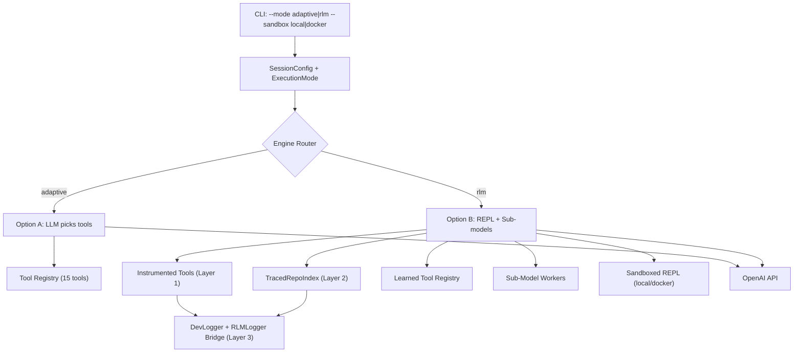
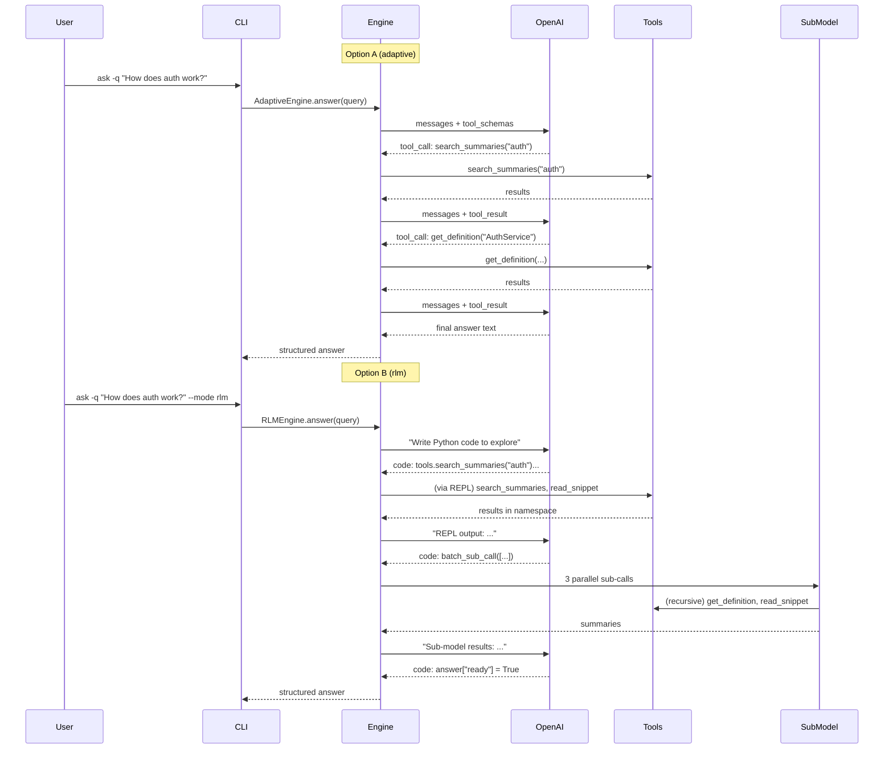

# RLM Dual-Mode Engine: Option A + Option B as Configurable Strategies

## 0. Design Document (DESIGN.md) -- First Deliverable

A standalone document at `codebase-agent/DESIGN.md` that records all architecture decisions, tradeoffs, and justifications. Sections:

### What We Implemented (and why)

- **Two execution modes (adaptive + rlm)** -- gives flexibility without complexity of three modes
- **Official `rlms` library for Option B** -- battle-tested REPL + recursion vs. building from scratch
- **Observer-pattern critic** (from AutoAgents) -- single `gpt-4o-mini` call as independent tool judge
- **Skill compositionality** (from Voyager) -- learned tools can call other learned tools
- **Multi-layer tracing** -- because arbitrary REPL code needs observability at tool, index, and trajectory levels
- **Configurable sandbox** -- local for dev speed, Docker for production safety
- **Usage telemetry on learned tools** -- lightweight reinforcement signal without a reward model

### What We Deferred (and why it's overkill now)

| Deferred                                                     | Reason                                                                          | When to revisit                                      |
| ------------------------------------------------------------ | ------------------------------------------------------------------------------- | ---------------------------------------------------- |
| Embedding-based skill retrieval (Voyager uses vector search) | We'll have 5-20 tools per codebase; flat list in prompt is fine                 | When library exceeds 50+ tools                       |
| Prometheus-Eval / TruLens for validation                     | A single `gpt-4o-mini` critic call suffices; no need for a dedicated eval model | When you need batch evaluation or model-independence |
| AST-level code instrumentation (Layer 4 tracing)             | Layers 1-3 provide sufficient observability                                     | When you need per-line cost attribution              |
| Full AutoAgents multi-observer pattern (3 observers)         | One observer (tool quality critic) covers our needs                             | When tools start having multi-step execution plans   |
| ColBERT embeddings for skill indexing                        | Semantic search unnecessary at small library scale                              | When shared skill libraries span multiple codebases  |
| Custom REPL sandbox (built from scratch)                     | `rlms` library already provides this                                            | Never (unless `rlms` is abandoned)                   |
| Deterministic playbook mode                                  | Both modes are LLM-driven now; playbooks were too rigid for novel questions     | Never (architectural decision)                       |

### Research Inspirations

- **RLM paper (arXiv 2512.24601)** -- core architecture: Root Model + REPL + Sub-Models
- **Voyager (Wang et al., 2023)** -- skill library as executable code, self-verification loop, compositionality
- **AutoAgents (Chen et al., 2024 / IJCAI)** -- Observer pattern for independent evaluation of generated artifacts
- **code-voyager (zenbase)** -- practical Voyager port to codebase navigation (validates the approach works in this domain)

## Architecture

The current `AgentLoop` in [engine.py](codebase-agent/src/codebase_agent/workflows/engine.py) uses deterministic `_exec_*` methods. We will introduce an `ExecutionMode` enum and two new engine classes that share the same tool registry, logging, and session infrastructure:



## Key Design Decisions

- **No more playbook mode**: The deterministic `_exec_*` playbook engine is removed. Both modes are LLM-driven.
- **Adaptive is the default**: Simpler, cheaper, and keeps structured tool calls visible. Used unless `--mode rlm` is specified.
- **Option B is unrestricted**: The RLM agent is not limited to our 15 tools. It gets the raw index + standard Python + sub-model calls. Tools are convenience helpers, not constraints. This is the key advantage over Option A.
- **Shared infrastructure**: Both modes use the same `_build_tool_registry()`, `DevLogger`, `UserLogger`, and `Session`.
- **OpenAI function calling**: Option A uses OpenAI's `tools` parameter for structured tool schemas.
- **Official `rlms` library for Option B**: Instead of building our own REPL sandbox and sub-model system, we wrap the MIT `rlms` package (`pip install rlms`). We inject our tool registry into its context and get REPL execution + recursive sub-calls + trajectory logging for free.
- **Configurable sandbox**: `--sandbox local` (default, fast dev) or `--sandbox docker` (isolated production). The `rlms` library supports both.
- **Sub-models can call tools recursively** (per your selection): A sub-model worker gets its own tool access with a depth limit to prevent runaway recursion.

## Files to Create/Modify

### New files

- `src/codebase_agent/workflows/adaptive_engine.py` -- Option A: LLM-driven tool loop using OpenAI function calling
- `src/codebase_agent/workflows/rlm_engine.py` -- Option B: wraps `rlms` library, injects tool registry + raw index + learned tools
- `src/codebase_agent/workflows/tool_schemas.py` -- OpenAI function-calling schemas generated from tool registry
- `src/codebase_agent/workflows/tracing.py` -- Multi-layer tracing: instrumented wrappers, TracedRepoIndex, RLMLogger bridge
- `src/codebase_agent/workflows/learned_tools.py` -- Learned tool registry: propose, validate, store, evict per-codebase

### Modified files

- [config.py](codebase-agent/src/codebase_agent/config.py) -- Add `ExecutionMode` enum and LLM config constants
- [session.py](codebase-agent/src/codebase_agent/core/session.py) -- Add `execution_mode` to `SessionConfig`
- [engine.py](codebase-agent/src/codebase_agent/workflows/engine.py) -- Remove playbook executors; extract tool registry into shared base; add factory method
- [cli/main.py](codebase-agent/src/codebase_agent/cli/main.py) -- Add `--mode` flag to `init` and `ask` commands
- [requirements.txt](codebase-agent/requirements.txt) -- Add `openai>=1.0` and `rlms`
- [.env.example](codebase-agent/.env.example) -- Document `EXECUTION_MODE`, `OPENAI_MODEL`, and `RLM_SANDBOX`

## Implementation Details

### 1. Configuration (config.py)

```python
from enum import Enum

class ExecutionMode(str, Enum):
    ADAPTIVE = "adaptive"    # Option A: LLM picks tools via structured calls
    RLM = "rlm"             # Option B: rlms library with REPL + sub-models

class SandboxMode(str, Enum):
    LOCAL = "local"          # Direct exec (fast, for dev)
    DOCKER = "docker"        # Isolated container (safe, for prod)

DEFAULT_EXECUTION_MODE = ExecutionMode.ADAPTIVE
DEFAULT_SANDBOX_MODE = SandboxMode.LOCAL
OPENAI_MODEL = "gpt-4o"
OPENAI_SUB_MODEL = "gpt-4o-mini"
MAX_ADAPTIVE_ROUNDS = 15
MAX_RLM_ITERATIONS = 10
MAX_SUB_MODEL_DEPTH = 2
```

### 2. Tool Schemas (tool_schemas.py)

Generate OpenAI function-calling schemas from the existing tool registry signatures. Each tool function's docstring + type hints become the schema `description` and `parameters`. This is used by both Option A and Option B.

### 3. Option A: Adaptive Engine (adaptive_engine.py)

Core loop:

1. Build system prompt with tool schemas + question
2. Call OpenAI with `tools=[...]` parameter
3. If model returns a `tool_call` -> execute it via `_tool_registry`, append result to messages
4. If model returns a final message -> extract answer, break
5. Repeat up to `MAX_ADAPTIVE_ROUNDS`

Key: Reuses `_call_tool()` pattern from existing engine for logging/tracing.

### 4. Option B: RLM Engine (rlm_engine.py)

Wraps the official `rlms` library. Our integration:

```python
from rlm import RLM
from rlm.logger import RLMLogger

class RLMEngine:
    def __init__(self, index, root_path, lsp=None, sandbox="local", **kwargs):
        self.tool_registry = _build_tool_registry(index, root_path, lsp)

        # Build the context string: tool signatures + index metadata
        context = self._build_rlm_context(index)

        # Initialize the official RLM client
        self.rlm = RLM(
            model=OPENAI_MODEL,
            logger=RLMLogger(log_dir=str(Path(root_path) / ".cache" / "rlm_traces")),
            # sandbox config based on SandboxMode
        )
        self._context = context

    def answer(self, parsed_query):
        # Inject our tools as callable functions in the RLM's REPL namespace
        # The rlms library handles the REPL loop, sub-calls, and recursion
        response = self.rlm.completion(
            prompt=self._build_prompt(parsed_query),
            context=self._context,
        )
        return self._format_answer(response)
```

Key integration points:

- The agent is NOT limited to our 15 tools. The REPL namespace exposes:
  - `tools.*` -- our 15 pre-built tool functions as convenient helpers (instrumented with Layer 1 tracing)
  - `learned_*` -- any previously synthesized tools from `LearnedToolRegistry`
  - `index` -- the raw `RepoIndex` wrapped in `TracedRepoIndex` proxy (Layer 2 tracing)
  - `root_path` -- the repo root for file operations
  - `sub_call` / `batch_sub_call` -- delegate to worker LLMs
  - `register_tool(name, code, description, test_cases)` -- synthesize new reusable tools
  - Standard Python: `re`, `pathlib`, `collections`, `json`, `ast`, etc.
- The agent can write **arbitrary exploration code** -- our tools are shortcuts, not constraints
- Example: "find all classes that inherit from BaseService AND are referenced in >3 files" -- no single tool does this, but the agent can write a 5-line loop over `index.symbols` and `index.name_reference_map`
- The `rlms` library handles the iteration loop, sub-model spawning, and sandbox execution
- We hook into `RLMLogger` to bridge trajectories into our existing `DevLogger`
- Sandbox mode (`local` or `docker`) is passed to the RLM constructor
- Sub-models get tool access (recursive) with depth limiting via `MAX_SUB_MODEL_DEPTH`

### 5. Multi-Layer Tracing for Option B (tracing.py)

Since the RLM agent writes arbitrary code (not just structured tool calls), we need multi-layer observability:

**Layer 1: Instrumented tool wrappers** -- logs every `tools.*` call with args/results

```python
def wrap_tools_with_tracing(tool_registry, dev_logger):
    """Wrap each tool function so it logs to DevLogger when called from REPL."""
    traced = {}
    for name, fn in tool_registry.items():
        def make_traced(n, f):
            def traced_fn(*args, **kwargs):
                trace_id = dev_logger.on_tool_start(n, kwargs)
                result = f(*args, **kwargs)
                dev_logger.on_tool_end(trace_id, str(result)[:2000], True)
                return result
            return traced_fn
        traced[name] = make_traced(name, fn)
    return traced
```

**Layer 2: TracedRepoIndex proxy** -- logs direct index access patterns

```python
class TracedRepoIndex:
    """Proxy that logs when the agent accesses index data directly."""
    def __init__(self, index, logger):
        self._index = index
        self._logger = logger

    @property
    def symbols(self):
        self._logger.log_access("index.symbols", count=len(self._index.symbols))
        return self._index.symbols

    @property
    def name_reference_map(self):
        self._logger.log_access("index.name_reference_map", count=len(self._index.name_reference_map))
        return self._index.name_reference_map

    # ... proxy all other attributes
```

**Layer 3: RLMLogger bridge** -- captures full trajectory from the `rlms` library and feeds it into `DevLogger`

```python
class DevLoggerBridge(RLMLogger):
    """Extends rlms RLMLogger to also emit events to our DevLogger."""
    def __init__(self, dev_logger, **kwargs):
        super().__init__(**kwargs)
        self._dev = dev_logger

    def on_iteration(self, code, output, sub_calls):
        super().on_iteration(code, output, sub_calls)
        self._dev.on_rlm_step(code=code, output=output, sub_calls=sub_calls)
```

### 6. Learned Tool Registry (learned_tools.py)

The RLM agent can define reusable tools as it learns patterns in a codebase. These persist across sessions. Inspired by Voyager's skill library (executable code, self-verification, compositionality) and AutoAgents' Observer pattern (independent LLM critic for validation).

```python
class LearnedToolRegistry:
    """Per-codebase registry of agent-synthesized tools."""

    def __init__(self, cache_dir: Path, openai_client):
        self.tools_dir = cache_dir / "learned_tools"
        self.manifest_path = self.tools_dir / "manifest.json"
        self._client = openai_client  # for Observer critic calls

    def propose_tool(self, name: str, code: str, description: str,
                     test_cases: list[dict]) -> dict:
        """Agent proposes a new tool. Two-stage validation before promotion."""
        # Stage 1: Deterministic -- compile + run test cases
        # Stage 2: Observer critic (AutoAgents pattern) -- LLM judges quality
        # Returns {"approved": bool, "feedback": str}

    def _observer_critic(self, name, code, description, test_results) -> dict:
        """Independent LLM call (gpt-4o-mini) that judges the proposed tool.
        Evaluates: correctness, generalizability, non-redundancy, safety."""
        # Single OpenAI call with structured rubric
        # Returns score (1-5) + approved (bool) + feedback (str)

    def get_active_tools(self, index_hash: str) -> dict[str, callable]:
        """Return validated tools, evicting stale ones. Learned tools can call
        other learned tools (compositionality -- Voyager pattern)."""

    def inject_into_namespace(self, namespace: dict, index_hash: str):
        """Add learned tools to the REPL namespace. Each tool has access to
        other learned tools via the shared namespace."""
        active = self.get_active_tools(index_hash)
        for name, fn in active.items():
            namespace[f"learned_{name}"] = fn
        # Also inject register_tool itself
        namespace["register_tool"] = self.propose_tool

    def record_usage(self, tool_name: str):
        """Track usage for telemetry and LRU eviction."""
```

Storage structure:

```
.cache/learned_tools/
  manifest.json         # {name, description, index_hash, created_at, last_used, use_count, approved_by_critic}
  find_django_views.py  # Actual tool code
  trace_api_chain.py
```

Lifecycle (Voyager-inspired with AutoAgents Observer):

1. Agent answers a complex question, notices a reusable pattern
2. Agent calls `register_tool(name, code, description, test_cases)` in the REPL
3. Stage 1: Deterministic validation -- compile code, run test cases
4. Stage 2: Observer critic -- `gpt-4o-mini` independently evaluates correctness, generalizability, non-redundancy
5. If both pass: tool is promoted to library
6. If critic rejects: feedback returned to agent for refinement and re-proposal
7. On next session: learned tools appear in the REPL namespace as `learned_*`
8. Learned tools can call other `learned_*` tools (compositionality)
9. Usage telemetry tracks which tools get used for which question types
10. Eviction: stale index hash OR LRU when cap (20 tools) exceeded

The RLM system prompt tells the agent:

```
You can define reusable tools via register_tool(name, code, description, test_cases).
The tool will be validated by test cases and an independent critic before promotion.
Previously learned tools are available as learned_* functions.
Learned tools can call other learned tools for composition.
```

### 7. CLI Integration (cli/main.py)

```python
@app.command()
def ask(
    ...
    mode: str = typer.Option("adaptive", "--mode", "-m",
                             help="Execution mode: adaptive or rlm"),
    sandbox: str = typer.Option("local", "--sandbox",
                                help="Sandbox mode for RLM: local or docker"),
    ...
):
```

### 8. Engine Factory (engine.py)

```python
def create_engine(mode: ExecutionMode, index, root_path, lsp=None, **kwargs):
    if mode == ExecutionMode.ADAPTIVE:
        from .adaptive_engine import AdaptiveEngine
        return AdaptiveEngine(index, root_path, lsp=lsp, **kwargs)
    elif mode == ExecutionMode.RLM:
        from .rlm_engine import RLMEngine
        return RLMEngine(index, root_path, lsp=lsp, **kwargs)
    raise ValueError(f"Unknown execution mode: {mode}")
```

## Data Flow Comparison



## Testing Strategy

- Unit tests for `tool_schemas.py` (verify schema generation matches function signatures)
- Unit tests for `tracing.py` (verify instrumented wrappers log correctly, TracedRepoIndex proxies all attributes)
- Unit tests for `learned_tools.py` (propose/validate/evict lifecycle, manifest persistence, LRU eviction)
- Integration test: run both modes on the same question, verify both produce valid answers
- Mock OpenAI responses for deterministic testing of the adaptive loop
- For RLM mode: verify full namespace injection (tools + learned + index + register_tool)
- Sandbox test: verify Docker mode works with `docker-compose` (existing setup)
