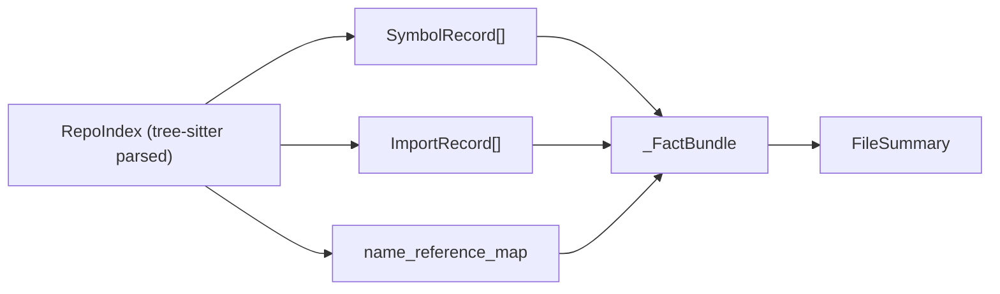
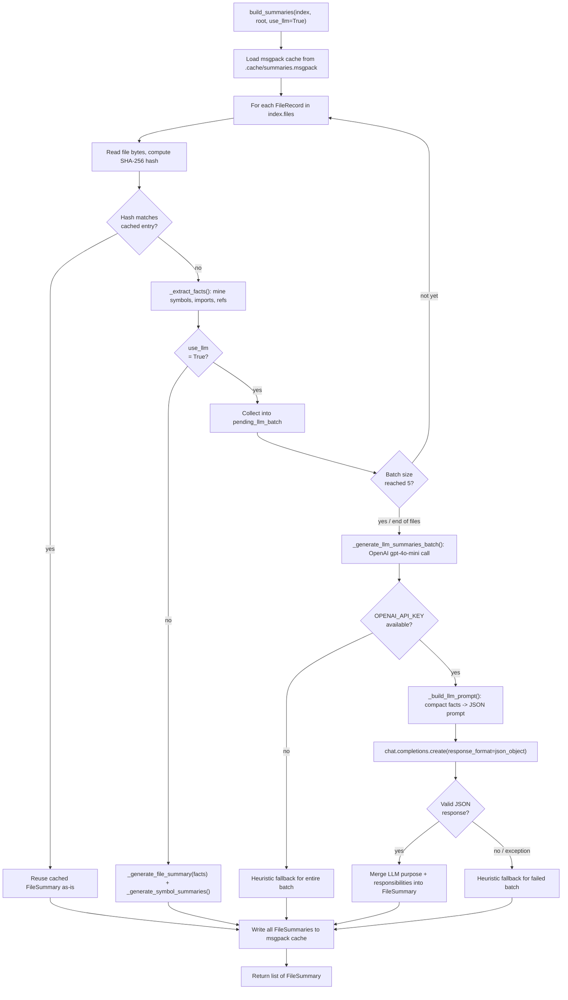
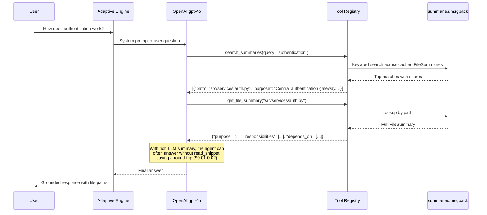

# Design Document: RLM Dual-Mode Codebase Navigation Agent

## Overview

This document records the architecture decisions, tradeoffs, and justifications for the RLM (Recursive Language Model) dual-mode engine that powers this codebase navigation agent. It explains what we built, what inspired our choices, what we deliberately deferred, and when those deferred items should be revisited.

## Problem Statement

Standard approaches to codebase Q&A suffer from fundamental limitations:

- **RAG (Retrieval-Augmented Generation)**: Blindly chunks code into a vector database, losing structural hierarchy. Cannot follow import chains, call graphs, or understand module boundaries.
- **Long-context stuffing**: Loading entire codebases into massive context windows causes "lost in the middle" degradation and prohibitive token costs.
- **Deterministic playbooks**: Hardcoded step sequences per question type cannot adapt to novel or cross-cutting queries.

The RLM approach (arXiv 2512.24601) solves this by treating the codebase as an **external environment** that the LLM actively explores via tools and code execution, rather than passive context.

## Architecture: Two Execution Modes

We implement two configurable modes, selectable via `--mode adaptive|rlm`:

### Option A: Adaptive Engine (default)

The LLM receives structured tool schemas and picks which tool to call next. Each action is a discrete, observable `tool_call` → `tool_result` pair.

- **Invocation**: Standard OpenAI function calling (`tools=[...]` parameter)
- **Observability**: Every tool call is explicitly logged
- **Limitations**: Agent can ONLY use the 15 pre-built tools; no custom logic
- **Cost**: 1 LLM call per tool selection step
- **Best for**: Simple to moderate questions (Tier 1-4)

### Option B: RLM Engine

The LLM writes arbitrary Python code executed in a REPL sandbox. It has unrestricted access to the index, tools, standard library, and sub-model delegation.

- **Invocation**: Wraps the official `rlms` library (MIT, pip install rlms)
- **Observability**: Multi-layer tracing (instrumented tools + proxy index + trajectory logger)
- **Limitations**: Higher cost, requires sandbox security consideration
- **Cost**: Multiple LLM calls (root iterations + sub-model workers)
- **Best for**: Complex, novel, or cross-cutting questions that no single tool answers

## What We Implemented (and Why)

### 1. Two modes, not three

We removed the old deterministic playbook engine entirely. Both modes are LLM-driven.

**Justification**: The playbook engine used hardcoded `_exec_*` methods per workflow type. It could not adapt to novel questions and fell back to `FEATURE_EXPLANATION` at 0.3 confidence for anything it couldn't classify. LLM-driven execution handles all question types naturally.

### 2. Official `rlms` library for Option B

Instead of building our own REPL sandbox and sub-model orchestration, we wrap the MIT `rlms` package.

**Justification**: The library is battle-tested by the paper's authors, handles sandbox execution (local + Docker), manages the iteration loop and sub-model spawning, and provides trajectory logging. Building this from scratch would duplicate ~2000 lines of infrastructure with no added value.

### 3. Observer-pattern critic for tool validation (from AutoAgents)

When the agent proposes a new learned tool, an independent `gpt-4o-mini` call judges it on correctness, generalizability, non-redundancy, and safety before promotion.

**Justification**: Test cases alone are insufficient — the agent writes both the tool and the tests, so it can "grade its own homework." An independent critic (the AutoAgents Observer pattern) provides an unbiased quality gate. Using `gpt-4o-mini` (different model size) adds independence cheaply without needing a dedicated evaluation model.

### 4. Skill compositionality (from Voyager)

Learned tools can call other learned tools, enabling increasingly complex abstractions.

**Justification**: Voyager demonstrated that compositional skill libraries compound capability over time. A tool like `trace_model_to_api(model_name)` naturally builds on simpler tools like `find_model_files(model_name)` and `find_references(symbol)`. Without compositionality, each tool is isolated and the library's value plateaus.

### 5. Multi-layer tracing

Three layers of observability for Option B:
- Layer 1: Instrumented tool wrappers (logs every `tools.*` call)
- Layer 2: TracedRepoIndex proxy (logs direct index access)
- Layer 3: RLMLogger bridge (captures full REPL trajectory)

**Justification**: In Option A, tracing is trivial (discrete tool calls). In Option B, the agent writes free-form code mixing tool calls, direct index access, and computation. Without multi-layer tracing, you'd have no visibility into what the agent actually did — making debugging, cost attribution, and quality assessment impossible.

### 6. Configurable sandbox (local/Docker)

`--sandbox local` for fast development, `--sandbox docker` for isolated production.

**Justification**: The RLM agent generates and executes arbitrary Python code. In development (controlled prompts, local machine), direct `exec()` is fast and sufficient. In production or shared environments, Docker isolation prevents any rogue code from affecting the host. The cost is ~200ms overhead per execution in Docker mode.

### 7. Usage telemetry on learned tools

Track which tools get used, for which question types, and how often.

**Justification**: This provides a lightweight reinforcement signal without needing a formal reward model. Tools that are never used get evicted (LRU). Tools used frequently for specific question types can be prioritized in future retrievals. It's the minimum viable "memory" the system needs to improve over time.

## What We Deferred (and Why It's Overkill Now)

| Deferred Item | What It Is | Why We Skipped It | When to Revisit |
|---|---|---|---|
| Embedding-based skill retrieval | Vector search over tool descriptions (Voyager uses this) | We'll have 5-20 tools per codebase; a flat list in the system prompt works fine. Adding embeddings requires a vector store dependency for marginal gain. | When the learned tool library exceeds 50+ tools per codebase, or when building a shared global skill library across users. |
| Prometheus-Eval / TruLens | Dedicated LLM-as-a-judge libraries with custom rubrics and evaluation models | A single `gpt-4o-mini` critic call achieves the same result without adding library dependencies or hosting a 7B evaluation model. | When you need batch evaluation of hundreds of proposed tools, or when you want the judge to be a fundamentally different model family for independence. |
| AST-level code instrumentation (Layer 4) | Parse generated code with `ast` module and inject logging at every function call node | Layers 1-3 provide sufficient observability for debugging and cost tracking. AST instrumentation adds complexity and performance overhead for marginal additional insight. | When you need per-line cost attribution or fine-grained performance profiling of generated code. |
| Full AutoAgents multi-observer pattern | Three separate observer roles (Agent Observer, Plan Observer, Action Observer) evaluating different aspects | One observer (tool quality critic) covers our validation needs. The agent's "plan" is implicit in its code, and "action" results are verified by test cases. | When learned tools start having multi-step execution plans that need plan-level review, or when the system is deployed multi-tenant with stricter quality requirements. |
| ColBERT embeddings for skill indexing | Late-interaction embedding model for semantic skill search (used by code-voyager) | Requires hosting a ColBERT model, building an index, and maintaining it. Overkill for <50 tools where keyword matching on descriptions suffices. | When shared skill libraries span multiple codebases and users, requiring cross-domain retrieval. |
| Custom REPL sandbox (built from scratch) | Our own restricted `exec()` environment with custom builtins | The `rlms` library already provides a tested sandbox implementation with configurable isolation (local, Docker, Modal, E2B). No reason to rebuild. | Never, unless the `rlms` library is abandoned or has fundamental limitations we can't work around. |
| Deterministic playbook mode | The original hardcoded `_exec_*` workflow executors | Both modes are LLM-driven. Playbooks were too rigid for novel questions and required maintaining 24 separate executor functions. | Never. This is a permanent architectural decision. The playbook definitions remain as reference material for system prompts. |

## Three-Tier NL Summarization System

### Problem

The adaptive and RLM engines both rely heavily on `search_summaries` and `get_file_summary` as their first exploration step. A playbook literally reads: *"Start with coarse exploration (search_summaries, search_symbols_tool) to find relevant files."* The quality of the entire Q&A pipeline therefore depends on the quality of these summaries — they are the index the LLM uses to orient itself before reading any code.

The original heuristic summaries were deliberately minimal:

- **Purpose** is assembled from symbol names: `"Implements UserService, AuthManager."`
- **Responsibilities** are templated: `"Defines UserService class"`, `"Provides authenticate function"`
- **Side effects** come from function name pattern matching: `"save_user may save"`
- **Confidence** maxes out at 0.85 — even with a docstring and symbols present

This is sufficient for routing (finding the right file) but produces poor explanations of *why* a file exists or *what design decision* it encodes. When the LLM calls `get_file_summary` on a complex service file, it gets a mechanically correct but semantically thin summary that forces it to immediately call `read_snippet` anyway — wasting a round trip and adding cost.

### Facts Extraction Pipeline (Heuristic Baseline)

Every `FileSummary` is derived from a `_FactBundle` — a struct populated by `_extract_facts()` from the parsed `RepoIndex`. This is a static analysis pass; no file content is read beyond what tree-sitter already extracted during indexing. Here is how each field is sourced:



| FileSummary field | Source in `_FactBundle` | Extraction logic | Example output |
|---|---|---|---|
| `main_symbols` | `main_classes` + `main_functions` | Filter `SymbolRecord.kind`: `"class"` → classes list, `"function"` / `"async_function"` → functions list. First 3 of each. | `["UserService", "AuthManager", "authenticate"]` |
| `purpose` | Assembled from boolean checks | Priority chain: (1) `"test" in file_path` → test purpose; (2) route decorators detected → API purpose; (3) has classes → implementation purpose; (4) has functions only → utility purpose; (5) fallback → bare module path. | `"Implements UserService, AuthManager."` |
| `responsibilities` | `main_classes[:2]` + `main_functions[:3]` + `side_effects[:2]` | Templated strings: `"Defines {cls} class"`, `"Provides {func} function"`, plus raw side-effect strings. Capped at 5. | `["Defines UserService class", "Provides authenticate function", "save_user may save"]` |
| `side_effects` | Pattern match on symbol names | For each symbol, check if its lowercased name contains any word from `SIDE_EFFECT_PATTERNS` (`write`, `save`, `send`, `delete`, `remove`, `post`, `put`, `create`, `insert`, `update`, `emit`, `publish`, `open`, `close`). Records `"{name} may {pattern}"`. | `["save_user may save", "send_notification may send"]` |
| `external_services` | Pattern match on import modules | For each import, check if its lowercased module path contains any word from `EXTERNAL_SERVICE_PATTERNS` (`requests`, `httpx`, `boto3`, `stripe`, `redis`, `celery`, `kafka`, etc.). Records the full module path. | `["boto3.s3", "redis"]` |
| `depends_on` | All imports for the file | Every `ImportRecord.module` for this file, first 5. No filtering — includes both internal and external imports. | `["fastapi", ".models", "datetime", "jwt"]` |
| `used_by` | Cross-file reference lookup | For each symbol defined in this file, query `index.name_reference_map[symbol.name]` to find other files that reference it. Deduplicates. First 5. | `["src/api/users.py", "tests/test_auth.py"]` |
| `data_models_touched` | `facts.data_models` | Currently always empty — the extraction logic for data model detection is stubbed. Reserved for future pydantic/SQLAlchemy model tracking. | `[]` |
| `confidence` | Composite score | Base `0.5` + `0.2` if any symbol has a docstring + `0.15` if classes or functions exist. Capped at `1.0`. Indicates how much signal the heuristic had to work with, not quality of output. | `0.85` (file with docstrings and classes) |
| `generated_from` | Tags indicating sources used | Always includes `["imports", "function_signatures"]`. Adds `"docstrings"` if any symbol had a docstring. LLM path would include `"llm"`. | `["imports", "function_signatures", "docstrings"]` |

#### Why these specific heuristics?

**Side-effect patterns** target function *names*, not bodies, because tree-sitter extraction captures signatures but not call-site analysis. The assumption is that well-named functions reveal their intent (a function named `delete_user` almost certainly deletes a user). This is cheap and correct for conventional Python code but blind to side effects in generically named functions.

**External service patterns** target *imports* rather than usage because import statements are the cheapest reliable signal that a file depends on an external system. A file that imports `boto3` interacts with AWS regardless of how it uses the library internally.

**Confidence scoring** is deliberately conservative. Even a fully-populated heuristic summary (docstrings + classes + functions) only reaches 0.85 — reflecting that static analysis cannot capture design intent, invariants, or architectural context that a human (or LLM) would include.

### Solution: Optional LLM Enhancement at the File Tier

We add a `use_llm=True` path to `build_summaries()` that calls `gpt-4o-mini` to generate richer `purpose` and `responsibilities` fields. The rest of the system (caching, directory summaries, symbol summaries, search indexing) is unchanged.

#### Why LLM Enhancement is Necessary

The heuristic approach has three structural limitations that cannot be solved by adding more patterns:

1. **No semantic understanding of relationships.** The heuristic knows that `auth.py` imports `jwt` and defines `AuthManager`, but it cannot infer that this file is *"the central authentication gateway that validates JWTs and manages session lifecycle for all API endpoints."* That requires understanding how the pieces fit together.

2. **Template blindness.** Every file with classes produces `"Implements X, Y."` regardless of whether the file is a core domain model, a thin adapter, or a configuration holder. The heuristic has no vocabulary for architectural roles.

3. **Wasted agent round trips.** When the adaptive engine calls `get_file_summary` and gets `"Implements UserService. Provides authenticate function."`, it has learned almost nothing beyond the class name. It must immediately call `read_snippet` to understand the file — the summary didn't save a round trip.

An LLM can solve all three: it interprets the *combination* of symbols, imports, and docstrings to produce a purpose statement that captures design intent, not just inventory.

#### Why only the file tier?

| Tier | LLM? | Justification |
|---|---|---|
| Directory | No | The role-map heuristic (`api/` -> `"HTTP route handlers"`) is already accurate and deterministic. Sending directory metadata to the LLM would be expensive with near-zero quality gain. |
| File | **Yes** | This is where semantic understanding matters most. The LLM can explain the design intent, not just enumerate symbols. This is the bottleneck tier. |
| Symbol | No | Docstrings already provide the best available source. For symbols without docstrings, the LLM has no additional signal beyond what the heuristic uses. Cost would be high (one call per symbol). |

#### Why gpt-4o-mini?

The `OPENAI_SUB_MODEL` config already defaults to `gpt-4o-mini` and is used throughout the codebase for low-stakes inference (learned tool critic, sub-model workers in RLM mode). File summarization is another low-stakes task — a slightly imperfect summary still beats the heuristic, and the cost difference vs `gpt-4o` is ~10x. The summarizer reads from `SUMMARY_LLM_MODEL` (defaults to `OPENAI_SUB_MODEL`) so users can override without affecting the rest of the system.

#### Why Keep Both Modes (Heuristic + LLM)?

The LLM path does not replace the heuristic — both coexist permanently as a **dual-mode design**. This is not a transition strategy where the heuristic gets deprecated once the LLM path is stable. Each mode exists because it solves a problem the other cannot:

**What the heuristic does better than the LLM:**

| Property | Heuristic | LLM |
|---|---|---|
| Offline operation | Works with zero network, zero API key | Requires `OPENAI_API_KEY` and network access |
| Determinism | Same input always produces same output | Nondeterministic by nature; same file can produce different wording across runs |
| Cost | Free | ~$0.03 per 500 files (first run), though cached afterwards |
| Speed | Microseconds per file (pure string matching) | ~200-500ms per batch (network round trip) |
| Structural fields | Ground-truth from static analysis (`depends_on`, `used_by`, `side_effects`, `external_services`, `main_symbols`) | Cannot produce these — has no access to the index or cross-file reference graph |
| CI/testing | Runs in any environment without secrets | Needs mock or API key in CI |

**What the LLM does better than the heuristic:**

| Property | LLM | Heuristic |
|---|---|---|
| Purpose quality | Interprets the *combination* of signals to produce architectural context (e.g., *"Central authentication gateway that validates JWTs and manages session lifecycle"*) | Template-based inventory (e.g., *"Implements AuthManager"*) |
| Vocabulary | Has natural language for design patterns, architectural roles, abstractions | Limited to hardcoded templates (`"Defines X class"`, `"Provides Y function"`) |
| Novel codebases | Adapts to any naming convention, framework, or domain | Relies on conventional names matching `SIDE_EFFECT_PATTERNS` and `EXTERNAL_SERVICE_PATTERNS` |
| Agent efficiency | Richer summaries let the adaptive engine make routing decisions without follow-up `read_snippet` calls, saving ~1-2 tool rounds per query | Thin summaries force the agent to immediately read source code, wasting a round trip |

**The hybrid structure:**

When `use_llm=True`, the LLM generates *only* the `purpose` and `responsibilities` fields. The remaining 8 fields of `FileSummary` (`main_symbols`, `depends_on`, `used_by`, `side_effects`, `external_services`, `data_models_touched`, `confidence`, `generated_from`) are always heuristic. This is because:

1. **Structural fields require the index graph.** `used_by` comes from `name_reference_map`, which cross-references every file in the repo. An LLM seeing a single file's facts cannot know which other files reference its symbols.

2. **Pattern-based fields are already correct.** `side_effects` and `external_services` are binary detection tasks (does this name match a pattern?). The heuristic is near-perfect for these — an LLM would add cost without adding accuracy.

3. **The LLM's advantage is prose, not data.** What the heuristic cannot do is *explain*. It can tell you a file defines `AuthManager` and imports `jwt`. It cannot tell you that this means the file *"owns the JWT validation pipeline and is the single entry point for session management across all API routes."* That semantic compression is uniquely valuable and uniquely LLM-shaped.

The result is that even in `use_llm=True` mode, the heuristic runs first (to populate the `_FactBundle`), the LLM runs second (to generate better prose from those facts), and the heuristic fields are merged unchanged into the final `FileSummary`. The LLM is an enhancement layer, not a replacement.

### Full Summarization Workflow



#### Step-by-step walkthrough

1. **Cache load.** Read the existing `summaries.msgpack` from `.cache/`. This is a dict of `{file_path: CachedSummary}`.

2. **Per-file hash check.** For each file in the index, read its bytes and compute `SHA-256`. If the hash matches the cache, reuse the stored `FileSummary` unchanged — regardless of whether it was LLM-generated or heuristic.

3. **Facts extraction.** For uncached (changed/new) files, run `_extract_facts()` to populate a `_FactBundle` from the index (no disk I/O beyond what the indexer already did).

4. **Mode branching.** If `use_llm=False`, go directly to `_generate_file_summary()` (heuristic). If `use_llm=True`, collect the file's path and facts into a pending batch.

5. **Batch dispatch.** When the batch reaches 5 files (or we've processed all files), dispatch `_generate_llm_summaries_batch()`. This builds a compact prompt from each file's facts and calls the OpenAI API once for the entire batch.

6. **LLM prompt construction.** `_build_llm_prompt()` formats each file as a compact block: classes, functions, imports, first available docstring. The total input for 5 files is ~1000 tokens. The system message asks for JSON output with `purpose` and `responsibilities` per file.

7. **Response parsing.** The LLM returns structured JSON. Each file's `purpose` and `responsibilities` are extracted and merged with the heuristic-computed fields (`side_effects`, `external_services`, `depends_on`, `used_by`, `main_symbols`). The LLM only replaces the *semantic* fields; structural fields remain heuristic.

8. **Fallback.** Any failure (missing API key, network error, malformed JSON, missing files in response) triggers per-batch heuristic fallback. The system never produces worse output than the baseline.

9. **Cache write.** All summaries (cached hits + heuristic + LLM) are serialized to msgpack and written atomically.

### Batching Strategy

Multiple files are packed into a single LLM call to reduce API round trips and cost. Each file's representation in the prompt is compact — drawn from the already-computed `_FactBundle`, not the raw source.

**Prompt shape (one call, N files):**

```
You are a code analyst. For each Python file below, write a concise summary
that explains the file's purpose and main responsibilities. Focus on design
intent and architectural role, not just listing symbols.

File 1: src/services/auth.py
- Classes: AuthManager
- Functions: verify_token, refresh_session
- Imports: jwt, redis, datetime
- Docstring: "Handles JWT authentication and session management."

File 2: src/api/users.py
- Classes: UserRouter
- Functions: list_users, get_user, delete_user
- Imports: fastapi, .models, .services.auth

Respond with JSON only:
{
  "files": [
    {"path": "src/services/auth.py", "purpose": "...", "responsibilities": ["...", "..."]},
    {"path": "src/api/users.py",     "purpose": "...", "responsibilities": ["...", "..."]}
  ]
}
```

**Why batch size = 5?**

Each file's compact representation is ~150-200 tokens of input. At batch size 5, one call is ~1000 input + ~500 output tokens — comfortably within `gpt-4o-mini`'s context and pricing sweet spot. Larger batches risk JSON truncation on output; smaller batches waste round trips.

**Cost estimate for a 500-file repo:**

- 100 API calls (500 files / 5 per batch)
- ~150K input tokens + ~75K output tokens
- Approximately $0.03 total at current `gpt-4o-mini` pricing
- First run only — subsequent runs hit the hash cache for unchanged files

### What the LLM Replaces vs What It Keeps

The LLM does not generate the entire `FileSummary` — it only enriches the semantic fields that heuristics do poorly:

| Field | Source with LLM | Source without LLM |
|---|---|---|
| `purpose` | **LLM-generated** | Heuristic template |
| `responsibilities` | **LLM-generated** | Heuristic template |
| `main_symbols` | Heuristic (unchanged) | Heuristic |
| `depends_on` | Heuristic (unchanged) | Heuristic |
| `used_by` | Heuristic (unchanged) | Heuristic |
| `side_effects` | Heuristic (unchanged) | Heuristic |
| `external_services` | Heuristic (unchanged) | Heuristic |
| `data_models_touched` | Heuristic (unchanged) | Heuristic |
| `confidence` | `0.9` | `0.50-0.85` |
| `generated_from` | `["llm", "facts"]` | `["imports", "function_signatures"]` |

This means the LLM call is small and focused. It receives the *facts* the heuristic already extracted and writes better prose from them. The factual fields (imports, symbols, references) remain ground-truth from static analysis.

### Cache Integration

LLM summaries use the **same `CachedSummary` model and msgpack format** as heuristic summaries. The file hash is the sole cache key — if the file hasn't changed, the existing summary is used regardless of whether it was LLM-generated or heuristic.

This means a repo can have mixed provenance in its cache (some files LLM-summarized, some not) without any inconsistency. Running `summarize --llm-summaries` a second time only regenerates files that changed.

### Failure Handling

The LLM path is additive — it never makes the system less reliable than the heuristic baseline:

| Failure scenario | Behavior |
|---|---|
| `OPENAI_API_KEY` not set | Falls back to heuristic for all files; no crash |
| One batch call raises an exception | That batch falls back to heuristic; other batches unaffected |
| LLM returns malformed JSON | `json.JSONDecodeError` caught per-batch; heuristic used |
| LLM omits some files from response | Missing files fall back to heuristic individually |

### Where This Fits in the Agent Loop

Summaries are not injected into the root prompt. They are on-demand tool results:



Richer LLM-generated summaries mean the agent can make better routing decisions in fewer rounds, reducing total cost per query even though summary generation is more expensive upfront. The one-time cost of ~$0.03 to summarize 500 files amortizes across every query that touches `search_summaries` or `get_file_summary`.

### Implementation Plan

The changes are scoped to 4 files, with no model changes or API surface changes:

| File | Change |
|---|---|
| `config.py` | Add `SUMMARY_LLM_MODEL` (defaults to `OPENAI_SUB_MODEL`) and `SUMMARY_BATCH_SIZE = 5` |
| `pyproject.toml` | Add `openai>=1.0` to dependencies (already imported by engines but not listed) |
| `summarizer.py` | Wire `use_llm` flag: collect uncached files into batches, call `_generate_llm_summaries_batch()`, merge results, fall back on failure |
| `tests/test_summarizer.py` | Add tests with mocked `OpenAI` client for the LLM path |

No changes to `models.py`, `tools.py`, `engine.py`, `adaptive_engine.py`, `rlm_engine.py`, or any CLI commands. The `--llm-summaries` flag already exists and is already passed through to `build_summaries(use_llm=...)`.

### What We Deferred

| Deferred | Reason |
|---|---|
| LLM symbol summaries | The docstring is already the best available signal for a symbol. Without the full function body in the prompt, the LLM has no additional information. Including source adds tokens; worth revisiting if summaries are used for code generation, not just routing. |
| LLM directory summaries | The role-map heuristic is already accurate for conventional directory names. The only gain would be for non-standard names, which is rare in well-structured Python projects. |
| Streaming LLM responses | Summaries are written to cache, not displayed to the user in real time. Streaming adds implementation complexity with no UX benefit here. |
| Async batching | All current OpenAI calls in the codebase are synchronous. Adding `asyncio` to `build_summaries` while the rest of the stack is sync would create an inconsistency. Revisit when the whole engine is async. |
| Per-symbol LLM enhancement | Cost scales with symbol count (~3-10x the number of files). Revisit if symbol-level semantic search becomes a use case. |
| Sending raw source code in prompts | Compact facts are sufficient for file-level purpose/responsibilities. Including source would add ~500-2000 tokens per file, increasing cost 5-10x with marginal quality improvement for *summary* generation. Revisit if the LLM needs to describe implementation details. |

## Research Inspirations

### RLM Paper (arXiv 2512.24601)

**Core contribution**: Teach LLMs to manage their own context by writing code in a REPL, rather than receiving everything in the prompt.

**What we adopted**: Root Model + REPL environment + Sub-Model workers architecture. The codebase is loaded as programmatic data, not prompt context. The model writes exploration code iteratively.

### Voyager (Wang et al., 2023)

**Core contribution**: Lifelong learning agent that stores executable skills, retrieves them semantically, verifies them with a critic, and composes complex behaviors from simpler ones.

**What we adopted**: Skill library as executable code (not descriptions), self-verification before promotion, compositionality (skills calling skills).

**What we deferred**: Embedding-based retrieval (overkill at our scale), automatic curriculum generation (not applicable to Q&A).

### AutoAgents (Chen et al., 2024 / IJCAI)

**Core contribution**: Dynamic generation of specialized agents with Observer roles that independently evaluate quality.

**What we adopted**: The Observer pattern — an independent LLM critic that evaluates proposed tools on a structured rubric before promotion.

**What we deferred**: Multi-observer architecture (3 roles), dynamic agent generation (we have fixed modes), collaborative refinement between observers.

### code-voyager (zenbase)

**Core contribution**: Practical port of Voyager's skill library to codebase navigation (for Claude Code). Validates that the approach works in this domain.

**What we adopted**: Confirmation that per-codebase skill storage, session-persistent memory, and SKILL.md metadata files are viable patterns.

**What we deferred**: ColBERT-based skill retrieval, Claude Code hook integration (we use CLI + OpenAI).

## Tradeoffs Summary

| Decision | Benefit | Cost |
|---|---|---|
| LLM-driven tool selection (Option A) | Handles novel questions; no classifier maintenance | ~$0.01-0.05 per query in LLM calls |
| Unrestricted REPL (Option B) | Maximum flexibility; cross-tool logic; sub-model parallelism | Higher cost (~$0.05-0.20); sandbox security needed |
| Single critic (not 3 observers) | Simple, cheap, sufficient validation | Might miss plan-level issues in complex tools |
| No embedding retrieval | Zero setup; works at current scale | Won't scale past ~50 tools without friction |
| `rlms` library dependency | Free REPL + sub-model infra | Coupled to MIT library's API stability |
| Removing playbook mode | Simpler codebase; unified LLM-driven approach | Lose guaranteed-fast deterministic paths for simple lookups |
